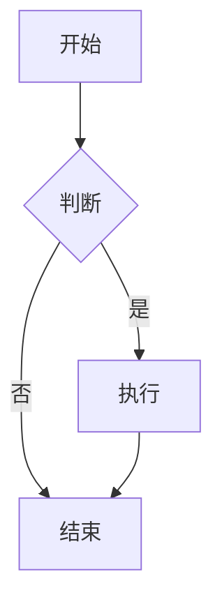

# 博客可视化统一格式指南

## 概述

为了优化博客性能和统一可视化格式，我们已经将所有的可视化库进行了统一管理。现在支持以下可视化类型：

- **Mermaid**: UML图表、流程图、时序图等
- **ECharts**: 复杂的数据可视化图表
- **Chart.js**: 简单直观的统计图表
- **Plotly**: 交互式科学图表
- **D3.js**: 自定义数据可视化
- **Three.js**: 3D可视化

## 性能优化

### 按需加载
- 核心库（Mermaid、ECharts、Chart.js）始终加载
- 可选库（Plotly、D3.js、Three.js）按需加载
- 减少初始页面加载时间

### 统一主题
- 自动适配明暗主题
- 统一的颜色方案
- 响应式设计

## 使用格式

### 1. Mermaid 图表

```markdown

```

### 2. ECharts 图表

#### 方式一：代码块格式
```markdown
```echarts
{
  "title": {
    "text": "销售数据"
  },
  "xAxis": {
    "type": "category",
    "data": ["一月", "二月", "三月"]
  },
  "yAxis": {
    "type": "value"
  },
  "series": [{
    "data": [120, 200, 150],
    "type": "bar"
  }]
}
```
```

#### 方式二：容器格式
```html
<div class="echarts-container" data-option='{
  "title": {"text": "销售数据"},
  "xAxis": {"type": "category", "data": ["一月", "二月", "三月"]},
  "yAxis": {"type": "value"},
  "series": [{"data": [120, 200, 150], "type": "bar"}]
}'></div>
```

### 3. Chart.js 图表

#### 方式一：代码块格式
```markdown
```chartjs
{
  "type": "line",
  "data": {
    "labels": ["一月", "二月", "三月"],
    "datasets": [{
      "label": "销售额",
      "data": [12, 19, 3],
      "borderColor": "rgb(75, 192, 192)"
    }]
  }
}
```
```

#### 方式二：容器格式
```html
<div class="chartjs-container" data-type="line" data-config='{
  "data": {
    "labels": ["一月", "二月", "三月"],
    "datasets": [{
      "label": "销售额",
      "data": [12, 19, 3],
      "borderColor": "rgb(75, 192, 192)"
    }]
  }
}'></div>
```

### 4. Plotly 图表

#### 方式一：代码块格式
```markdown
```plotly
{
  "data": [{
    "x": [1, 2, 3, 4],
    "y": [10, 11, 12, 13],
    "type": "scatter"
  }],
  "layout": {
    "title": "散点图"
  }
}
```
```

#### 方式二：容器格式
```html
<div class="plotly-chart" 
     data-plotly-data='[{"x": [1,2,3,4], "y": [10,11,12,13], "type": "scatter"}]'
     data-plotly-layout='{"title": "散点图"}'></div>
```

### 5. D3.js 图表

```html
<div class="d3-chart" data-type="bar" data-d3-data='[
  {"name": "A", "value": 10},
  {"name": "B", "value": 20},
  {"name": "C", "value": 15}
]'></div>
```

### 6. Three.js 3D可视化

```html
<div class="three-js-container" data-config='{
  "geometry": "cube",
  "material": "basic",
  "animation": true
}'></div>
```

## 迁移指南

### 运行迁移脚本

```bash
python migrate_visualization.py
```

这个脚本会：
1. 分析所有历史文章
2. 统一可视化格式
3. 优化容器样式
4. 生成迁移报告

### 手动迁移步骤

1. **Mermaid**: 保持现有格式不变
2. **ECharts**: 将代码块转换为容器格式
3. **Chart.js**: 添加类型和配置属性
4. **Plotly**: 分离数据和布局配置

## 最佳实践

### 1. 选择合适的图表类型

- **流程图/架构图**: 使用 Mermaid
- **数据可视化**: 使用 ECharts
- **简单统计**: 使用 Chart.js
- **科学图表**: 使用 Plotly
- **自定义可视化**: 使用 D3.js
- **3D展示**: 使用 Three.js

### 2. 性能考虑

- 避免在单个页面使用过多图表
- 使用按需加载的可选库
- 优化图表配置，减少不必要的动画

### 3. 主题适配

- 图表会自动适配明暗主题
- 使用统一的颜色方案
- 确保在两种主题下都有良好的可读性

### 4. 响应式设计

- 所有图表都支持响应式
- 在移动设备上自动调整大小
- 保持良好的用户体验

## 故障排除

### 常见问题

1. **图表不显示**
   - 检查JSON格式是否正确
   - 确认容器类名是否正确
   - 查看浏览器控制台错误信息

2. **主题切换问题**
   - 确保图表配置支持主题切换
   - 检查颜色配置是否正确

3. **性能问题**
   - 减少同时加载的图表数量
   - 使用按需加载的可选库
   - 优化图表配置

### 调试工具

- 浏览器开发者工具
- 控制台日志
- 网络面板查看资源加载

## 更新日志

### v2.0.0 (当前版本)
- 统一可视化库管理
- 实现按需加载
- 优化主题适配
- 添加迁移工具

### v1.0.0 (历史版本)
- 基础可视化支持
- 多种库并行使用
- 手动主题配置 