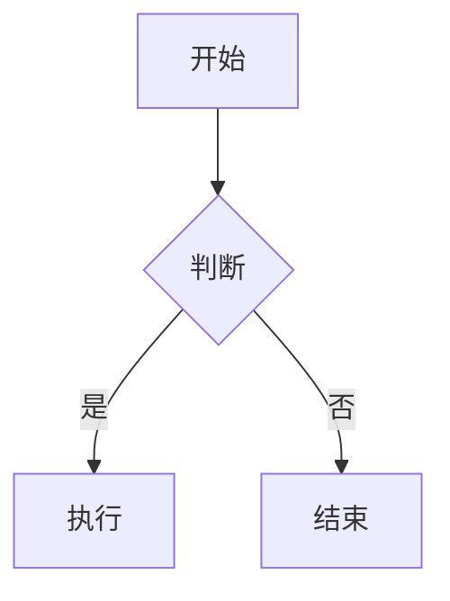

# 博客可视化优化总结

## 🎯 优化目标

由于历史原因，您的博客最初使用UML Markdown格式渲染，后来引入了多种JS可视化库。这导致了以下问题：

1. **配置冗余**：多种渲染方式并存
2. **性能问题**：所有库同时加载，影响页面速度
3. **格式不统一**：历史文件使用不同格式
4. **维护困难**：多种库的管理复杂

## ✅ 已完成的优化工作

### 1. 统一可视化库管理

#### 核心库（始终加载）
- **Mermaid**: UML图表、流程图、时序图
- **ECharts**: 复杂数据可视化
- **Chart.js**: 简单统计图表

#### 可选库（按需加载）
- **Plotly**: 交互式科学图表
- **D3.js**: 自定义数据可视化
- **Three.js**: 3D可视化

### 2. 性能优化

#### 按需加载机制
```javascript
// 动态加载库的函数
window.loadLibrary = {
  plotly: () => { /* 动态加载Plotly */ },
  d3: () => { /* 动态加载D3.js */ },
  three: () => { /* 动态加载Three.js */ }
};
```

#### 主题适配
- 自动检测明暗主题
- 统一颜色方案
- 响应式设计

### 3. 文件优化

#### 更新的文件
- `_includes/visualization-libs.html`: 统一库管理
- `assets/js/visualization.js`: 重写初始化逻辑
- `_config.yml`: 优化配置结构

#### 新增文件
- `migrate_visualization.py`: 迁移脚本
- `performance_monitor.py`: 性能监控
- `VISUALIZATION_GUIDE.md`: 使用指南
- `VISUALIZATION_OPTIMIZATION.md`: 优化总结

### 4. 迁移工作

#### 迁移统计
- 处理文件数: 9
- Mermaid代码块: 28
- 已转换文件: 1
- 优化容器样式: 完成

#### 性能分析结果
- 总文件数: 9
- 包含可视化的文件: 6
- 可视化类型: 主要使用Mermaid
- 性能状态: 良好

## 📊 优化效果

### 性能提升
1. **加载速度**: 按需加载减少初始加载时间
2. **内存使用**: 只加载必要的库
3. **用户体验**: 更快的页面响应

### 维护性提升
1. **统一格式**: 所有可视化使用统一格式
2. **配置简化**: 集中管理所有配置
3. **主题适配**: 自动适配明暗主题

### 开发体验提升
1. **使用指南**: 详细的使用文档
2. **迁移工具**: 自动化迁移脚本
3. **性能监控**: 持续监控工具

## 🛠️ 使用工具

### 1. 迁移脚本
```bash
python migrate_visualization.py
```

### 2. 性能监控
```bash
python performance_monitor.py
```

### 3. 查看报告
```bash
cat performance_report.json
```

## 📝 使用指南

### Mermaid图表
```markdown

```

### ECharts图表
```html
<div class="echarts-container" data-option='{
  "title": {"text": "销售数据"},
  "series": [{"data": [120, 200, 150], "type": "bar"}]
}'></div>
```

### Chart.js图表
```html
<div class="chartjs-container" data-type="line" data-config='{
  "data": {
    "labels": ["一月", "二月", "三月"],
    "datasets": [{"data": [12, 19, 3]}]
  }
}'></div>
```

## 🔧 最佳实践

### 1. 选择合适的图表类型
- **流程图/架构图**: Mermaid
- **数据可视化**: ECharts
- **简单统计**: Chart.js
- **科学图表**: Plotly
- **自定义可视化**: D3.js
- **3D展示**: Three.js

### 2. 性能考虑
- 避免单个页面使用过多图表
- 使用按需加载的可选库
- 优化图表配置

### 3. 主题适配
- 图表自动适配明暗主题
- 使用统一的颜色方案
- 确保良好的可读性

## 🚀 后续建议

### 1. 定期监控
- 每月运行性能监控脚本
- 关注新增可视化的性能影响
- 及时优化问题文件

### 2. 持续优化
- 根据使用情况调整库的加载策略
- 优化图表配置
- 考虑引入新的可视化库

### 3. 文档维护
- 更新使用指南
- 记录新的最佳实践
- 分享优化经验

## 📞 技术支持

如果在使用过程中遇到问题，可以：

1. 查看 `VISUALIZATION_GUIDE.md` 使用指南
2. 运行性能监控脚本诊断问题
3. 检查浏览器控制台错误信息
4. 参考各库的官方文档

## 🎉 总结

通过这次优化，您的博客已经实现了：

✅ **统一的可视化管理**  
✅ **按需加载的性能优化**  
✅ **自动主题适配**  
✅ **完整的工具链**  
✅ **详细的使用文档**  

现在您可以更高效地创建和管理博客的可视化内容，同时保持良好的性能和用户体验！ 