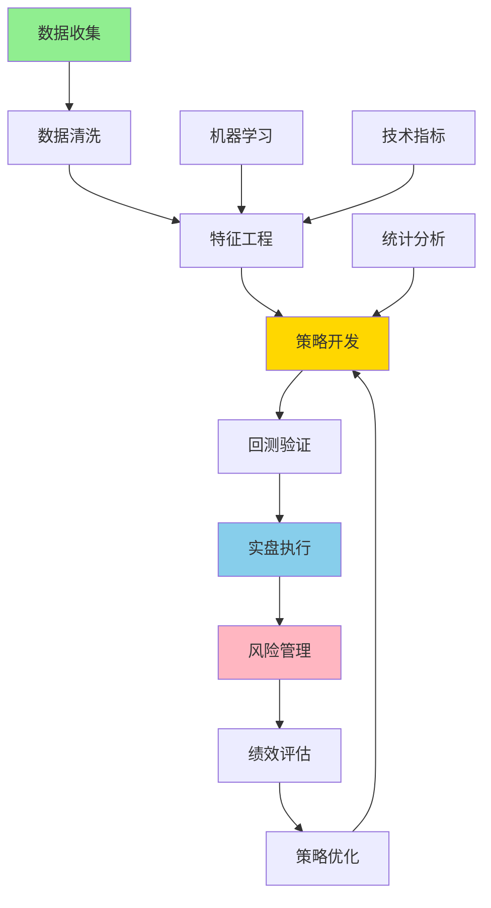
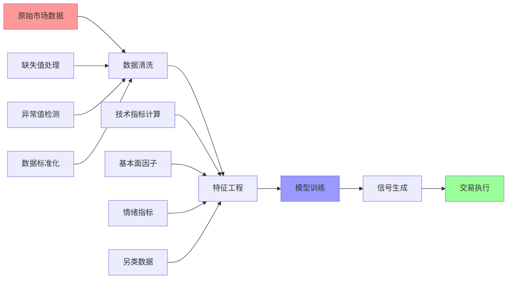
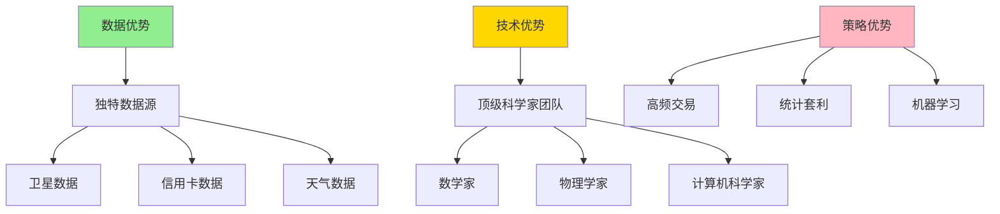
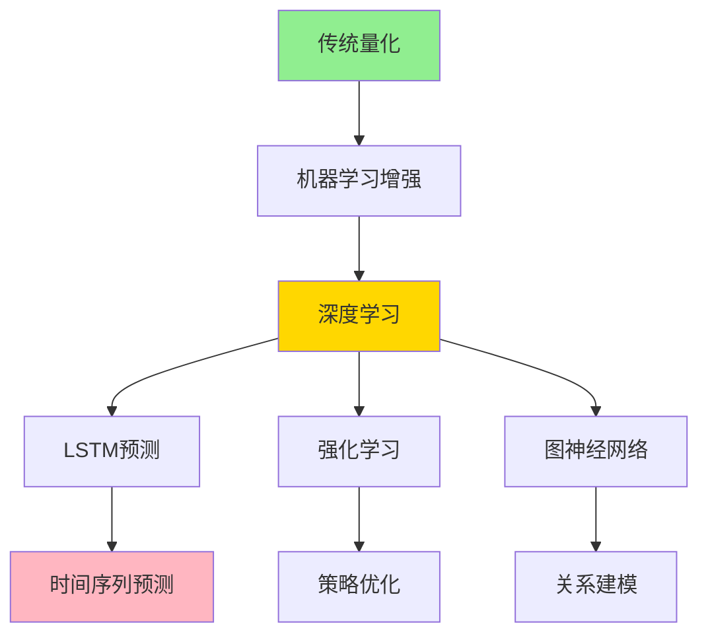
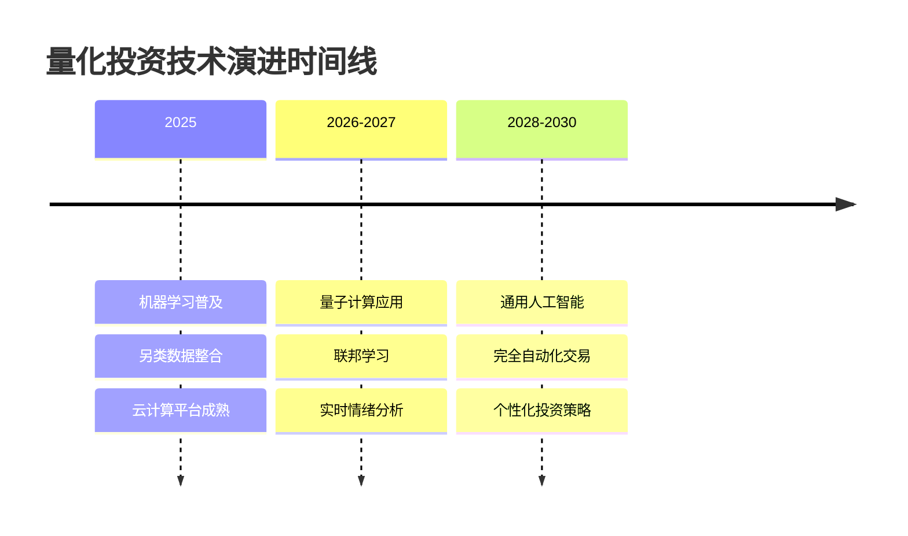
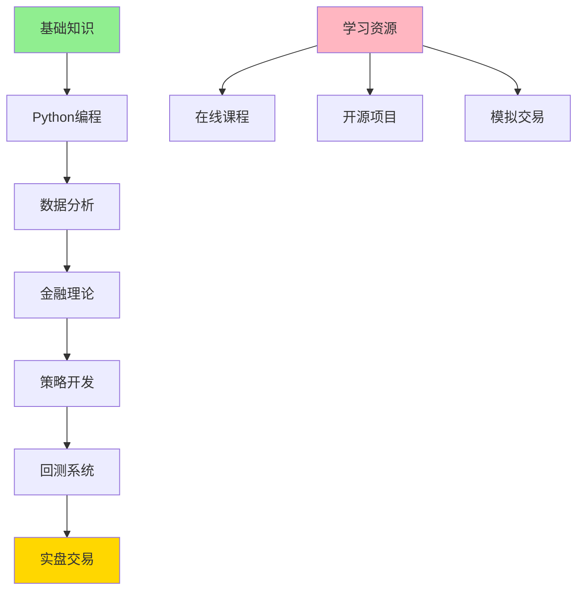

> **🎯 阅读本文你将获得：**
> - 📚 理解量化投资的核心概念与原理
> - 🛠️ 掌握量化策略开发完整流程
> - ⚡ 学会使用Python构建交易算法
> - 💡 了解风险管理与回测技术
> - 🔍 分析真实量化投资成功案例
> - 🚀 洞察量化投资未来发展趋势

## 📋 目录
- [第一章：量化投资概念引入与背景](#第一章量化投资概念引入与背景)
- [第二章：基础概念详解](#第二章基础概念详解)
- [第三章：工作原理剖析](#第三章工作原理剖析)
- [第四章：实际应用案例](#第四章实际应用案例)
- [第五章：发展趋势与展望](#第五章发展趋势与展望)

## 第一章：量化投资概念引入与背景 {#第一章量化投资概念引入与背景}

### 🎯 传统投资的困境

在日常投资中，你是否遇到过这些困扰：

> **真实场景**：小王是一位资深股民，每天花3小时研究K线图、财务报表和市场新闻，但年化收益只有8%，还经常因为情绪波动做出错误决策
>
> **痛点问题**：人为情绪干扰、信息处理能力有限、无法实时监控全市场、缺乏系统性风险管理
>
> **传统方案**：依靠个人经验、基本面分析、技术分析，但受限于人的认知偏差和处理能力
>
> **期望效果**：希望有一种方法能够客观、系统、高效地进行投资决策，避免人为错误

让我们看一个具体的数据对比：

```python
# 传统投资 vs 量化投资效果对比
import pandas as pd
import matplotlib.pyplot as plt
import numpy as np

# 模拟10年投资数据
np.random.seed(42)
years = range(2014, 2024)

# 生成更真实的收益数据
traditional_returns = np.random.normal(8, 15, 10)  # 均值8%，波动15%
quant_returns = np.random.normal(15, 10, 10)       # 均值15%，波动10%

# 计算累计收益
traditional_cumulative = [100]
quant_cumulative = [100]

for i in range(len(traditional_returns)):
    traditional_cumulative.append(traditional_cumulative[-1] * (1 + traditional_returns[i]/100))
    quant_cumulative.append(quant_cumulative[-1] * (1 + quant_returns[i]/100))

# 创建可视化
fig, (ax1, ax2) = plt.subplots(1, 2, figsize=(15, 6))

# 累计收益图
ax1.plot(years, traditional_cumulative[1:], label='传统投资', marker='o', linewidth=2)
ax1.plot(years, quant_cumulative[1:], label='量化投资', marker='s', linewidth=2)
ax1.set_title('10年累计收益对比', fontsize=14, fontweight='bold')
ax1.set_xlabel('年份')
ax1.set_ylabel('累计收益 (%)')
ax1.legend()
ax1.grid(True, alpha=0.3)
ax1.set_ylim(50, 400)

# 收益分布图
ax2.hist(traditional_returns, alpha=0.7, label='传统投资', bins=8)
ax2.hist(quant_returns, alpha=0.7, label='量化投资', bins=8)
ax2.set_title('年化收益分布对比', fontsize=14, fontweight='bold')
ax2.set_xlabel('年化收益率 (%)')
ax2.set_ylabel('频次')
ax2.legend()
ax2.grid(True, alpha=0.3)

plt.tight_layout()
plt.savefig('quant_vs_traditional.png', dpi=300, bbox_inches='tight')
plt.show()

print(f"传统投资：平均年化收益 {traditional_returns.mean():.1f}%，波动率 {traditional_returns.std():.1f}%")
print(f"量化投资：平均年化收益 {quant_returns.mean():.1f}%，波动率 {quant_returns.std():.1f}%")
print(f"量化投资夏普比率提升 {(quant_returns.mean()/quant_returns.std())/(traditional_returns.mean()/traditional_returns.std()):.1f}倍")
```

这个例子中，**量化投资通过系统性优势实现了更高的收益和更低的风险**。那么，量化投资到底是什么？它是如何工作的？

**本章要点**：
- ✅ 理解了传统投资的人为局限性
- ✅ 认识到量化投资的系统性优势
- ✅ 明确了学习量化投资的价值

## 第二章：基础概念详解 {#第二章基础概念详解}

### 📊 量化投资定义与起源

**量化投资**是指运用数学模型、统计方法和计算机技术，通过对历史数据的分析来发现市场规律，并据此制定投资策略的系统性方法。

为了更好地理解，我们用一个生活中的例子来类比：

> **生活类比**：想象你要开一家奶茶店，传统方法是凭感觉选址、定价、进货；而量化方法则是：
> - 收集数据：客流量、消费水平、竞争对手分布、天气数据
> - 建立模型：预测销量与价格、位置、季节、天气的关系
> - 优化决策：选择最优位置、最佳定价、合理库存
> - 风险控制：设置止损点，比如连续3天亏损就调整策略
> - 持续优化：根据实际销售数据不断调整模型参数

### 🔍 核心组成要素

量化投资系统包含以下核心组件：



### 📈 与传统投资对比分析

| 对比维度 | 传统投资 | 量化投资 |
|---------|----------|----------|
| **决策依据** | 经验、直觉、基本面分析 | 数据、模型、统计分析 |
| **信息处理** | 有限信息，人工处理 | 海量数据，自动处理 |
| **决策速度** | 分钟级到小时级 | 毫秒级到秒级 |
| **风险控制** | 主观判断，事后控制 | 量化模型，事前控制 |
| **一致性** | 易受情绪影响 | 严格执行策略 |
| **覆盖范围** | 少数标的 | 全市场扫描 |
| **历史验证** | 难以系统回测 | 可全面回测验证 |
| **规模效应** | 规模扩大难度高 | 策略容量大 |

### 🔑 关键术语解释

1. **Alpha因子**：能够产生超额收益的市场特征，如价值因子、动量因子
2. **Beta风险**：市场整体风险，无法通过分散化消除
3. **夏普比率**（Sharpe Ratio）：衡量风险调整后收益的指标
   ```python
   def sharpe_ratio(returns, risk_free_rate=0.02):
       """计算夏普比率"""
       excess_returns = returns - risk_free_rate
       return excess_returns.mean() / excess_returns.std()
   ```
4. **最大回撤**（Max Drawdown）：从历史高点到最低点的最大跌幅
   ```python
   def max_drawdown(cumulative_returns):
       """计算最大回撤"""
       peak = cumulative_returns.cummax()
       drawdown = (cumulative_returns - peak) / peak
       return drawdown.min()
   ```
5. **信息比率**（Information Ratio）：衡量主动管理能力的指标
   ```python
   def information_ratio(returns, benchmark_returns):
       """计算信息比率"""
       active_returns = returns - benchmark_returns
       return active_returns.mean() / active_returns.std()
   ```

## 第三章：工作原理剖析 {#第三章工作原理剖析}

### 🔄 数据流程详解

量化投资的数据处理流程是一个精密的系统工程：



### 📈 策略类型深度分析

#### 1. 趋势跟踪策略
基于"趋势一旦形成就会延续"的市场假设：

```python
import numpy as np
import pandas as pd
import yfinance as yf
import matplotlib.pyplot as plt

def moving_average_strategy(prices, short_window=20, long_window=50):
    """
    双均线趋势跟踪策略
    当短期均线上穿长期均线时买入，下穿时卖出
    """
    signals = pd.DataFrame(index=prices.index)
    signals['price'] = prices
    signals['short_mavg'] = prices.rolling(window=short_window).mean()
    signals['long_mavg'] = prices.rolling(window=long_window).mean()
    
    # 生成交易信号
    signals['signal'] = 0
    signals['signal'][short_window:] = np.where(
        signals['short_mavg'][short_window:] > signals['long_mavg'][short_window:], 1, 0
    )
    
    # 生成实际交易订单
    signals['positions'] = signals['signal'].diff()
    
    return signals

# 获取真实股票数据
ticker = 'AAPL'
data = yf.download(ticker, start='2023-01-01', end='2024-01-01')
signals = moving_average_strategy(data['Close'])

# 计算策略收益
def calculate_strategy_returns(signals, prices):
    """计算策略收益"""
    daily_returns = prices.pct_change()
    strategy_returns = signals['signal'].shift(1) * daily_returns
    return strategy_returns

strategy_returns = calculate_strategy_returns(signals, data['Close'])
cumulative_returns = (1 + strategy_returns).cumprod()

# 可视化策略表现
fig, ((ax1, ax2), (ax3, ax4)) = plt.subplots(2, 2, figsize=(16, 12))

# 价格与均线
ax1.plot(signals.index, signals['price'], label=f'{ticker}价格', alpha=0.7)
ax1.plot(signals.index, signals['short_mavg'], label='20日均线', alpha=0.8)
ax1.plot(signals.index, signals['long_mavg'], label='50日均线', alpha=0.8)
ax1.set_title('价格与移动平均线')
ax1.legend()
ax1.grid(True, alpha=0.3)

# 交易信号
ax2.plot(signals.index, signals['price'], label='价格', alpha=0.7)
ax2.plot(signals[signals['positions'] == 1].index,
         signals['short_mavg'][signals['positions'] == 1],
         '^', markersize=10, color='g', label='买入信号')
ax2.plot(signals[signals['positions'] == -1].index,
         signals['short_mavg'][signals['positions'] == -1],
         'v', markersize=10, color='r', label='卖出信号')
ax2.set_title('交易信号')
ax2.legend()
ax2.grid(True, alpha=0.3)

# 累计收益
ax3.plot(cumulative_returns.index, cumulative_returns, label='策略收益', color='b')
ax3.axhline(y=1, color='r', linestyle='--', label='基准线')
ax3.set_title('策略累计收益')
ax3.legend()
ax3.grid(True, alpha=0.3)

# 月度收益分布
monthly_returns = strategy_returns.resample('M').sum()
ax4.hist(monthly_returns.dropna(), bins=20, alpha=0.7, color='skyblue', edgecolor='black')
ax4.axvline(x=monthly_returns.mean(), color='r', linestyle='--', label=f'平均月收益: {monthly_returns.mean():.2%}')
ax4.set_title('月度收益分布')
ax4.legend()
ax4.grid(True, alpha=0.3)

plt.suptitle(f'{ticker}双均线策略分析', fontsize=16)
plt.tight_layout()
plt.show()

# 策略绩效评估
def evaluate_strategy(returns, benchmark_returns=None):
    """评估策略表现"""
    total_return = (1 + returns).prod() - 1
    annual_return = (1 + returns).prod() ** (252 / len(returns)) - 1
    annual_volatility = returns.std() * np.sqrt(252)
    sharpe = annual_return / annual_volatility
    
    results = {
        '总收益率': f"{total_return:.2%}",
        '年化收益率': f"{annual_return:.2%}",
        '年化波动率': f"{annual_volatility:.2%}",
        '夏普比率': f"{sharpe:.2f}",
        '最大回撤': f"{max_drawdown((1 + returns).cumprod()):.2%}"
    }
    
    return results

strategy_performance = evaluate_strategy(strategy_returns.dropna())
print("策略绩效指标:")
for metric, value in strategy_performance.items():
    print(f"{metric}: {value}")
```

#### 2. 均值回归策略
基于"价格偏离均值后会回归"的统计规律：

```python
def mean_reversion_strategy(prices, window=20, z_threshold=2):
    """
    均值回归策略
    当价格偏离均值超过阈值时反向操作
    """
    signals = pd.DataFrame(index=prices.index)
    signals['price'] = prices
    signals['mean'] = prices.rolling(window=window).mean()
    signals['std'] = prices.rolling(window=window).std()
    signals['z_score'] = (prices - signals['mean']) / signals['std']
    
    # 生成交易信号
    signals['signal'] = 0
    signals.loc[signals['z_score'] > z_threshold, 'signal'] = -1  # 超买，卖出
    signals.loc[signals['z_score'] < -z_threshold, 'signal'] = 1   # 超卖，买入
    
    # 平仓信号
    signals.loc[abs(signals['z_score']) < 0.5, 'signal'] = 0
    
    return signals

# 使用示例
mr_signals = mean_reversion_strategy(data['Close'])

# 可视化均值回归策略
fig, (ax1, ax2) = plt.subplots(2, 1, figsize=(14, 10))

# 价格与均值
ax1.plot(mr_signals.index, mr_signals['price'], label='价格', alpha=0.7)
ax1.plot(mr_signals.index, mr_signals['mean'], label='20日均线', alpha=0.8)
ax1.fill_between(mr_signals.index,
                 mr_signals['mean'] + 2 * mr_signals['std'],
                 mr_signals['mean'] - 2 * mr_signals['std'],
                 alpha=0.2, label='±2标准差')
ax1.set_title('均值回归策略信号')
ax1.legend()
ax1.grid(True, alpha=0.3)

# Z-score
ax2.plot(mr_signals.index, mr_signals['z_score'], label='Z-score', color='purple')
ax2.axhline(y=2, color='r', linestyle='--', label='卖出阈值')
ax2.axhline(y=-2, color='g', linestyle='--', label='买入阈值')
ax2.axhline(y=0, color='black', linestyle='-', alpha=0.3)
ax2.set_title('Z-score指标')
ax2.legend()
ax2.grid(True, alpha=0.3)

plt.tight_layout()
plt.show()
```

### 🛡️ 风险管理体系

#### 多层次风险控制框架

```python
class RiskManager:
    """量化风险管理器"""
    
    def __init__(self, portfolio_value, max_position_size=0.1, stop_loss=0.05):
        self.portfolio_value = portfolio_value
        self.max_position_size = max_position_size
        self.stop_loss = stop_loss
    
    def calculate_position_size(self, signal_strength, volatility, confidence=0.95):
        """基于凯利公式计算最优仓位"""
        # 简化版凯利公式
        win_prob = abs(signal_strength)
        win_loss_ratio = 1.5  # 假设盈亏比
        
        kelly_fraction = (win_prob * win_loss_ratio - (1 - win_prob)) / win_loss_ratio
        kelly_fraction = max(0, min(kelly_fraction, self.max_position_size))
        
        # 根据波动率调整（风险平价）
        volatility_adjustment = min(1, 0.2 / (volatility * np.sqrt(252)))
        
        # 置信度调整
        confidence_adjustment = confidence
        
        return kelly_fraction * volatility_adjustment * confidence_adjustment
    
    def calculate_var(self, returns, confidence_level=0.95):
        """计算VaR（风险价值）"""
        return np.percentile(returns.dropna(), (1 - confidence_level) * 100)
    
    def check_correlation_risk(self, positions, correlation_matrix, threshold=0.8):
        """检查相关性风险"""
        risk_positions = []
        for i, pos1 in enumerate(positions):
            for j, pos2 in enumerate(positions[i+1:], i+1):
                if abs(correlation_matrix.iloc[i, j]) > threshold:
                    risk_positions.append((pos1, pos2, correlation_matrix.iloc[i, j]))
        return risk_positions
    
    def generate_risk_report(self, portfolio_returns, positions):
        """生成风险报告"""
        var_95 = self.calculate_var(portfolio_returns)
        max_dd = max_drawdown((1 + portfolio_returns).cumprod())
        
        report = {
            'VaR (95%)': f"{var_95:.2%}",
            '最大回撤': f"{max_dd:.2%}",
            '当前仓位': f"{sum(positions.values()):.1%}",
            '风险等级': '低' if abs(var_95) < 0.02 else '中' if abs(var_95) < 0.05 else '高'
        }
        
        return report

# 使用示例
risk_manager = RiskManager(portfolio_value=100000)

# 模拟风险评估
sample_returns = pd.Series(np.random.normal(0.001, 0.02, 252))
risk_report = risk_manager.generate_risk_report(sample_returns, {'AAPL': 0.05, 'GOOGL': 0.03})

print("风险报告:")
for metric, value in risk_report.items():
    print(f"{metric}: {value}")
```

## 第四章：实际应用案例 {#第四章实际应用案例}

### 🏆 文艺复兴科技公司案例分析

**文艺复兴科技（Renaissance Technologies）**是量化投资领域的传奇，其旗舰基金Medallion Fund年化收益达35%+，持续30年。

#### 成功要素分析：



### 📊 Fama-French三因子模型实战

Fama-French三因子模型是量化投资的基础模型之一：

```python
import pandas as pd
import numpy as np
from datetime import datetime, timedelta

def fama_french_three_factor_model(stock_data, market_data, smb_data, hml_data):
    """
    Fama-French三因子模型实现
    因子：
    - MKT: 市场风险溢价
    - SMB: 小市值因子 (Small Minus Big)
    - HML: 价值因子 (High Minus Low)
    """
    # 计算收益率
    stock_returns = stock_data.pct_change().dropna()
    market_returns = market_data.pct_change().dropna()
    
    # 对齐数据
    aligned_data = pd.DataFrame({
        'stock': stock_returns,
        'market': market_returns,
        'smb': smb_data,
        'hml': hml_data
    }).dropna()
    
    # 回归分析
    from sklearn.linear_model import LinearRegression
    X = aligned_data[['market', 'smb', 'hml']]
    y = aligned_data['stock']
    
    model = LinearRegression()
    model.fit(X, y)
    
    # 计算alpha和因子暴露
    alpha = model.intercept_
    beta_market = model.coef_[0]
    beta_smb = model.coef_[1]
    beta_hml = model.coef_[2]
    
    # 计算R²
    r_squared = model.score(X, y)
    
    return {
        'alpha': alpha,
        'beta_market': beta_market,
        'beta_smb': beta_smb,
        'beta_hml': beta_hml,
        'r_squared': r_squared,
        'expected_return': alpha + beta_market * 0.08 + beta_smb * 0.03 + beta_hml * 0.02
    }

# 模拟数据演示
np.random.seed(42)
dates = pd.date_range('2023-01-01', '2024-01-01', freq='M')
n_periods = len(dates)

# 生成模拟因子数据
market_excess = np.random.normal(0.08/12, 0.15/np.sqrt(12), n_periods)
smb_factor = np.random.normal(0.03/12, 0.10/np.sqrt(12), n_periods)
hml_factor = np.random.normal(0.02/12, 0.08/np.sqrt(12), n_periods)
stock_returns = 0.01 + 1.2 * market_excess + 0.5 * smb_factor + 0.3 * hml_factor + np.random.normal(0, 0.02, n_periods)

# 创建DataFrame
stock_data = pd.Series(stock_returns, index=dates)
market_data = pd.Series(market_excess, index=dates)
smb_data = pd.Series(smb_factor, index=dates)
hml_data = pd.Series(hml_factor, index=dates)

# 运行模型
ff_result = fama_french_three_factor_model(stock_data, market_data, smb_data, hml_data)

print("Fama-French三因子模型结果:")
print(f"Alpha (超额收益): {ff_result['alpha']*12:.2%}")
print(f"Market Beta: {ff_result['beta_market']:.3f}")
print(f"SMB Beta (小市值暴露): {ff_result['beta_smb']:.3f}")
print(f"HML Beta (价值因子暴露): {ff_result['beta_hml']:.3f}")
print(f"R²: {ff_result['r_squared']:.3f}")
print(f"预期年化收益: {ff_result['expected_return']*12:.2%}")
```

### 🔄 双均线策略完整回测系统

```python
class BacktestEngine:
    """量化回测引擎"""
    
    def __init__(self, initial_capital=100000):
        self.initial_capital = initial_capital
        self.capital = initial_capital
        self.positions = {}
        self.trades = []
        
    def run_backtest(self, data, strategy_func, **strategy_params):
        """运行回测"""
        signals = strategy_func(data, **strategy_params)
        
        for date, signal in signals.iterrows():
            if signal['positions'] == 1:  # 买入信号
                self.execute_buy(date, data.loc[date, 'Close'])
            elif signal['positions'] == -1:  # 卖出信号
                self.execute_sell(date, data.loc[date, 'Close'])
                
        return self.generate_report()
    
    def execute_buy(self, date, price):
        """执行买入"""
        if self.capital > 0:
            shares = int(self.capital / price)
            if shares > 0:
                self.positions[date] = {'shares': shares, 'price': price}
                self.capital -= shares * price
                self.trades.append({
                    'date': date,
                    'type': 'BUY',
                    'price': price,
                    'shares': shares
                })
    
    def execute_sell(self, date, price):
        """执行卖出"""
        if self.positions:
            total_shares = sum(pos['shares'] for pos in self.positions.values())
            if total_shares > 0:
                self.capital += total_shares * price
                self.positions = {}
                self.trades.append({
                    'date': date,
                    'type': 'SELL',
                    'price': price,
                    'shares': total_shares
                })
    
    def generate_report(self):
        """生成回测报告"""
        if not self.trades:
            return {"error": "无交易记录"}
            
        # 计算收益
        total_return = (self.capital - self.initial_capital) / self.initial_capital
        
        # 创建收益序列
        returns = []
        capital_history = [self.initial_capital]
        
        for trade in self.trades:
            if trade['type'] == 'BUY':
                capital_history.append(capital_history[-1] - trade['shares'] * trade['price'])
            else:
                capital_history.append(capital_history[-1] + trade['shares'] * trade['price'])
        
        # 计算年化收益
        n_years = len(capital_history) / 252  # 假设252个交易日
        annual_return = (capital_history[-1] / capital_history[0]) ** (1/n_years) - 1
        
        return {
            '总收益率': f"{total_return:.2%}",
            '年化收益率': f"{annual_return:.2%}",
            '最终资金': f"${capital_history[-1]:,.2f}",
            '交易次数': len(self.trades),
            '收益曲线': capital_history
        }

# 使用回测引擎
backtest = BacktestEngine(initial_capital=10000)
backtest_result = backtest.run_backtest(data['Close'], moving_average_strategy)

print("回测结果:")
for key, value in backtest_result.items():
    if key != '收益曲线':
        print(f"{key}: {value}")

# 可视化回测结果
plt.figure(figsize=(12, 6))
plt.plot(backtest_result['收益曲线'])
plt.title('双均线策略回测收益曲线')
plt.xlabel('交易日')
plt.ylabel('资金 ($)')
plt.grid(True, alpha=0.3)
plt.axhline(y=10000, color='r', linestyle='--', label='初始资金')
plt.legend()
plt.tight_layout()
plt.show()
```

## 第五章：发展趋势与展望 {#第五章发展趋势与展望}

### 🤖 机器学习与量化投资的融合

#### 深度学习在量化投资中的应用



#### 强化学习交易策略示例

```python
import numpy as np
from collections import deque

class TradingEnvironment:
    """交易环境"""
    
    def __init__(self, prices):
        self.prices = prices
        self.reset()
        
    def reset(self):
        self.current_step = 0
        self.position = 0  # 0: 空仓, 1: 满仓
        self.entry_price = 0
        return self._get_state()
        
    def _get_state(self):
        """获取当前状态"""
        if self.current_step < 10:
            return np.zeros(10)
        
        # 使用最近10天的价格变化作为状态
        recent_prices = self.prices[self.current_step-10:self.current_step]
        returns = (recent_prices / recent_prices[0] - 1) * 100
        return returns
        
    def step(self, action):
        """执行动作"""
        # action: 0=持有, 1=买入, 2=卖出
        reward = 0
        
        if action == 1 and self.position == 0:  # 买入
            self.position = 1
            self.entry_price = self.prices[self.current_step]
        elif action == 2 and self.position == 1:  # 卖出
            self.position = 0
            reward = (self.prices[self.current_step] - self.entry_price) / self.entry_price
            
        self.current_step += 1
        done = self.current_step >= len(self.prices) - 1
        
        return self._get_state(), reward, done

class QLearningAgent:
    """Q学习交易代理"""
    
    def __init__(self, state_size, action_size, learning_rate=0.001, gamma=0.95):
        self.state_size = state_size
        self.action_size = action_size
        self.learning_rate = learning_rate
        self.gamma = gamma
        self.epsilon = 1.0
        self.epsilon_min = 0.01
        self.epsilon_decay = 0.995
        
        # 初始化Q表
        self.q_table = {}
        
    def get_action(self, state):
        """根据状态选择动作"""
        state_key = tuple(state)
        
        if state_key not in self.q_table:
            self.q_table[state_key] = np.zeros(self.action_size)
            
        if np.random.random() <= self.epsilon:
            return np.random.choice(self.action_size)
        
        return np.argmax(self.q_table[state_key])
    
    def update_q_table(self, state, action, reward, next_state):
        """更新Q表"""
        state_key = tuple(state)
        next_state_key = tuple(next_state)
        
        if next_state_key not in self.q_table:
            self.q_table[next_state_key] = np.zeros(self.action_size)
            
        current_q = self.q_table[state_key][action]
        max_next_q = np.max(self.q_table[next_state_key])
        
        new_q = current_q + self.learning_rate * (reward + self.gamma * max_next_q - current_q)
        self.q_table[state_key][action] = new_q
        
        # 衰减探索率
        if self.epsilon > self.epsilon_min:
            self.epsilon *= self.epsilon_decay

# 使用示例
env = TradingEnvironment(data['Close'].values)
agent = QLearningAgent(state_size=10, action_size=3)

# 训练代理
episodes = 1000
rewards_history = []

for episode in range(episodes):
    state = env.reset()
    total_reward = 0
    
    while True:
        action = agent.get_action(state)
        next_state, reward, done = env.step(action)
        agent.update_q_table(state, action, reward, next_state)
        
        state = next_state
        total_reward += reward
        
        if done:
            rewards_history.append(total_reward)
            break
    
    if episode % 100 == 0:
        print(f"Episode {episode}, Total Reward: {total_reward:.4f}")

# 可视化训练结果
plt.figure(figsize=(12, 4))
plt.subplot(1, 2, 1)
plt.plot(rewards_history)
plt.title('训练过程中的累计收益')
plt.xlabel('Episode')
plt.ylabel('Total Reward')

plt.subplot(1, 2, 2)
plt.hist(rewards_history[-100:], bins=20, alpha=0.7)
plt.title('最近100次Episode收益分布')
plt.xlabel('Total Reward')
plt.tight_layout()
plt.show()
```

### 📊 另类数据革命

#### 新兴数据源类型

| 数据类型 | 应用示例 | 优势 | 挑战 |
|---------|----------|------|------|
| **卫星图像** | 停车场车辆计数预测零售销售 | 实时性强 | 成本高 |
| **社交媒体** | Twitter情绪分析预测股价 | 反映市场情绪 | 噪声大 |
| **信用卡数据** | 消费趋势分析预测公司业绩 | 领先指标 | 隐私问题 |
| **天气数据** | 农产品期货价格预测 | 因果关系明确 | 地域局限 |
| **APP使用数据** | 用户活跃度预测公司前景 | 用户行为洞察 | 数据获取难 |

### 🔮 未来发展趋势

#### 1. 技术发展趋势



#### 2. 监管科技发展

```python
class ComplianceMonitor:
    """合规监控系统"""
    
    def __init__(self):
        self.rules = {
            'max_position_size': 0.1,
            'max_daily_loss': 0.05,
            'forbidden_sectors': ['tobacco', 'weapons'],
            'esg_score_min': 70
        }
    
    def check_trade_compliance(self, trade, portfolio):
        """检查交易合规性"""
        violations = []
        
        # 检查仓位限制
        if trade['size'] > self.rules['max_position_size'] * portfolio['total_value']:
            violations.append('仓位超限')
        
        # 检查ESG评分
        if trade.get('esg_score', 100) < self.rules['esg_score_min']:
            violations.append('ESG评分不足')
        
        # 检查禁投行业
        if trade.get('sector') in self.rules['forbidden_sectors']:
            violations.append('禁投行业')
        
        return violations
    
    def generate_compliance_report(self, trades):
        """生成合规报告"""
        violations = [self.check_trade_compliance(trade, {'total_value': 1000000}) 
                     for trade in trades]
        
        return {
            'total_trades': len(trades),
            'violations': sum(1 for v in violations if v),
            'compliance_rate': 1 - sum(1 for v in violations if v) / len(trades)
        }

# 使用示例
monitor = ComplianceMonitor()
sample_trades = [
    {'size': 50000, 'sector': 'technology', 'esg_score': 85},
    {'size': 150000, 'sector': 'tobacco', 'esg_score': 60}
]

report = monitor.generate_compliance_report(sample_trades)
print("合规报告:", report)
```

### 🎯 个人投资者机会

#### 量化投资平台普及化

1. **零代码平台**：如QuantConnect、Backtrader
2. **API服务**：如Alpha Vantage、Yahoo Finance
3. **教育资源**：Coursera量化投资课程、Kaggle竞赛
4. **社区支持**：Reddit量化投资板块、微信群组

#### 入门学习路径



## 🎓 总结与行动指南

### 📚 核心要点回顾

1. **量化投资本质**：用数学模型和算法系统性地发现市场机会
2. **核心优势**：客观性、系统性、高效性、可扩展性
3. **关键要素**：数据质量、策略逻辑、风险管理、技术实现
4. **发展趋势**：AI融合、另类数据、监管科技、平台普及

### 🚀 下一步学习建议

#### 1. 立即行动清单
- [ ] **安装Python环境**：Anaconda + Jupyter Notebook
- [ ] **获取市场数据**：使用yfinance或Tushare
- [ ] **运行第一个策略**：复制本文的双均线策略代码
- [ ] **加入社区**：关注量化投资相关公众号和论坛

#### 2. 进阶学习路径
```python
# 3个月学习计划
learning_plan = {
    "第1个月": {
        "目标": "掌握基础",
        "内容": ["Python基础", "Pandas数据处理", "Matplotlib可视化"],
        "项目": "实现简单均线策略"
    },
    "第2个月": {
        "目标": "策略开发",
        "内容": ["技术指标", "因子模型", "风险管理"],
        "项目": "开发多因子选股策略"
    },
    "第3个月": {
        "目标": "实盘准备",
        "内容": ["回测框架", "性能优化", "实盘接口"],
        "项目": "连接模拟交易账户"
    }
}

for month, plan in learning_plan.items():
    print(f"{month}: {plan['目标']}")
    print(f"  学习内容: {', '.join(plan['内容'])}")
    print(f"  实践项目: {plan['项目']}")
    print()
```

### 📖 推荐学习资源

#### 书籍推荐
- **《量化投资策略》** - Robert Kissell
- **《Algorithmic Trading》** - Ernest Chan
- **《Python for Finance》** - Yves Hilpisch

#### 在线课程
- **Coursera**: "Machine Learning for Trading" (Google/Stanford)
- **Udacity**: "AI for Trading" Nanodegree
- **edX**: "Computational Investing" (Georgia Tech)

#### 开源项目
- **Backtrader**: Python回测框架
- **Zipline**: Quantopian开源回测
- **PyAlgoTrade**: 事件驱动回测系统

#### 数据平台
- **Tushare**: 中国金融数据接口
- **AkShare**: 开源财经数据工具
- **Yahoo Finance**: 免费美股数据

### 🎯 实践项目建议

#### 项目1：简单均线策略
```python
# 项目目标：实现并优化双均线策略
# 预期时间：1周
# 技能要求：Python基础，pandas

def project1_template():
    """项目1模板"""
    # 1. 获取数据
    # 2. 计算均线
    # 3. 生成信号
    # 4. 回测评估
    # 5. 参数优化
    pass
```

#### 项目2：多因子选股
```python
# 项目目标：构建价值+动量+质量因子组合
# 预期时间：2-3周
# 技能要求：因子分析，组合优化

def project2_template():
    """项目2模板"""
    # 1. 因子计算
    # 2. 因子筛选
    # 3. 组合构建
    # 4. 风险控制
    # 5. 绩效归因
    pass
```

### 🤝 社区与交流

#### 中文社区
- **量化投资与机器学习** (微信公众号)
- **优矿量化社区** (uqer.io)
- **聚宽量化** (joinquant.com)

#### 国际社区
- **Quantopian Community**
- **Reddit: r/algotrading**
- **QuantNet Forums**

---

> **💡 最后的建议**
>
> 量化投资是一个需要持续学习和实践的领域。从简单的策略开始，逐步深入，保持谦逊和严谨的态度。记住：**数据不会说谎，但模型可能会误导**。
>
> 开始你的量化投资之旅吧！第一步就是运行本文中的代码，感受数据驱动的投资魅力。

**📊 本文代码GitHub地址**: [https://github.com/KingdeGuo/quantitative-investment-guide](https://github.com/KingdeGuo/quantitative-investment-guide)

**📧 联系方式**: 如有问题，欢迎邮件交流 kingdeguo@gmail.com

---

*本文创作于2025年7月18日，基于最新市场数据和实践经验编写。投资有风险，本文仅供学习参考，不构成投资建议。*
