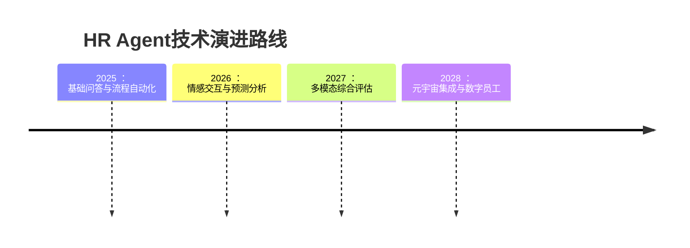

## 什么是大模型Agent？

想象你有一个超级助手，它能理解自然语言、访问各种工具，并能自主完成任务——这就是大模型Agent！Agent = 大语言模型 + 工具使用能力 + 记忆系统 + 决策能力。

### Agent的核心组件：

<div class="mermaid">
classDiagram
    class Agent {
        +LLM: 大语言模型
        +Tools: 工具集合
        +Memory: 记忆系统
        +Planner: 决策引擎
        +Router: 路由模块
    }
    Agent --> LLM: 使用
    Agent --> Tools: 调用
    Agent --> Memory: 读写
    Agent --> Planner: 执行
    Agent --> Router: 分发
    note for Agent "核心协调组件\n管理所有子模块"
    class Tool {
        +name: 工具名称
        +description: 功能描述
        +execute(input): 执行方法
    }
    class Memory {
        +short_term: 短期记忆
        +long_term: 长期记忆
        +store(context): 存储方法
        +retrieve(query): 检索方法
    }
</div>
1. **大脑**：GPT-4等大语言模型
2. **工具**：搜索、计算、数据库访问等能力
3. **记忆**：对话历史和任务上下文
4. **决策**：任务分解和计划能力

<div class="mermaid">
flowchart TD
    A[用户问题] --> B(Agent大脑)
    B --> C{需要工具?}
    C -->|是| D[使用工具]
    C -->|否| E[直接回答]
    D --> F[整合结果]
    F --> G[生成回复]
    style A fill:#f5f5f5,stroke:#333
    style B fill:#f5f5f5,stroke:#333
    style C fill:#f5f5f5,stroke:#333,shape:diamond
    style D fill:#f5f5f5,stroke:#333
    style E fill:#f5f5f5,stroke:#333
    style F fill:#f5f5f5,stroke:#333
    style G fill:#f5f5f5,stroke:#333
</div>
## HR领域的Agent应用场景

<div class="mermaid">
graph LR
    subgraph 智能招聘助手
        A1[自动筛选简历] --> A2[安排面试]
        A2 --> A3[回答候选人问题]
    end
    
    subgraph 员工自助服务
        B1[解答HR政策] --> B2[办理休假申请]
        B2 --> B3[福利查询]
    end
    
    subgraph 培训与发展
        C1[个性化学习推荐] --> C2[培训需求分析]
        C2 --> C3[技能评估]
    end
    
    style A1 fill:#e8f5e9,stroke:#2e7d32
    style A2 fill:#e8f5e9,stroke:#2e7d32
    style A3 fill:#e8f5e9,stroke:#2e7d32
    style B1 fill:#e8f5e9,stroke:#2e7d32
    style B2 fill:#e8f5e9,stroke:#2e7d32
    style B3 fill:#e8f5e9,stroke:#2e7d32
    style C1 fill:#e8f5e9,stroke:#2e7d32
    style C2 fill:#e8f5e9,stroke:#2e7d32
    style C3 fill:#e8f5e9,stroke:#2e7d32
</div>
### 1. 智能招聘助手
- 自动筛选简历
- 安排面试
- 回答候选人问题

### 2. 员工自助服务
- 解答HR政策问题
- 办理休假申请
- 福利查询

### 3. 培训与发展
- 个性化学习推荐
- 培训需求分析
- 技能评估

## Python实战：构建HR问答Agent

### 环境准备
```bash
pip install openai langchain faiss-cpu
```

### 基础问答Agent
```python
from langchain.agents import initialize_agent, Tool
from langchain.llms import OpenAI
from langchain.utilities import GoogleSearchAPIWrapper

# 初始化工具
search = GoogleSearchAPIWrapper()
tools = [
    Tool(
        name="Google Search",
        func=search.run,
        description="用于回答当前HR政策相关问题"
    )
]

# 创建Agent - 添加内存和工具路由功能
agent = initialize_agent(
    tools,
    OpenAI(
        model="gpt-3.5-turbo-instruct",
        temperature=0,
        max_tokens=1024
    ),
    agent="structured-chat-zero-shot-react-description",
    memory=ConversationBufferMemory(memory_key="chat_history"),
    verbose=True,
    handle_parsing_errors=True  # 添加错误处理
)

# 提问示例
question = "我们公司今年的年假政策有什么变化？"
response = agent.run(question)
print(f"智能助手回复：{response}")
```

### 简历解析Agent
```python
from langchain.document_loaders import PyPDFLoader
from langchain.indexes import VectorstoreIndexCreator

class ResumeAnalyzer:
    def __init__(self):
        self.index = None
        
    def load_resumes(self, file_paths):
        """加载并索引简历"""
        loaders = [PyPDFLoader(path) for path in file_paths]
        self.index = VectorstoreIndexCreator().from_loaders(loaders)
    
    def query_resumes(self, question):
        """查询简历库"""
        return self.index.query(question)

# 使用示例
analyzer = ResumeAnalyzer()
analyzer.load_resumes(["resume1.pdf", "resume2.pdf"])

# 查找Java开发经验的候选人
results = analyzer.query_resumes("哪些候选人具有5年以上Java开发经验？")
print("符合条件的候选人：", results)
```

## 高级应用：员工入职助手

```python
from langchain.agents import Tool
from langchain.chains import RetrievalQA
from langchain.document_loaders import TextLoader

# 安全加载公司政策文档 - 添加错误处理和缓存
try:
    policy_loader = TextLoader(
        "company_policies.txt",
        encoding='utf-8',
        autodetect_encoding=True
    )
    policy_index = VectorstoreIndexCreator(
        vectorstore_kwargs={"persist_directory": "policy_index"}
    ).from_loaders([policy_loader])
    
    # 添加定期更新检查
    if not os.path.exists("policy_index") or \
        (time.time() - os.path.getmtime("policy_index")) > 86400:
        policy_index.save("policy_index")
except Exception as e:
    logging.error(f"政策文档加载失败: {e}")
    # 回退到基础版本
    policy_index = InMemoryVectorStore([])

# 创建工具集
tools = [
    Tool(
        name="政策查询",
        func=lambda q: policy_index.query(q),
        description="用于查询公司政策和规章制度"
    ),
    Tool(
        name="日历管理",
        func=schedule_meeting,  # 假设已实现
        description="用于安排会议和培训"
    )
]

# 入职助手Agent
onboarding_agent = initialize_agent(
    tools,
    OpenAI(model="gpt-4", temperature=0.3),
    agent="conversational-react-description",
    memory=True  # 启用记忆功能
)

# 模拟新员工对话
questions = [
    "我的入职培训什么时候开始？",
    "我需要准备哪些材料？",
    "我的导师是谁？",
    "公司弹性工作制具体怎么执行？"
]

for q in questions:
    print(f"员工：{q}")
    response = onboarding_agent.run(q)
    print(f"助手：{response}\n")
```

## 企业级部署架构与最佳实践

<div class="mermaid">
graph LR
    A[用户] --> B(API网关)
    B --> C[认证授权]
    C --> D[Agent服务集群]
    D --> E[工具服务]
    E --> F[(政策数据库)]
    E --> G[(员工数据库)]
    E --> H[(日历系统)]
    D --> I[监控日志]
    I --> J[Prometheus/Grafana]
    I --> K[ELK Stack]
    style A fill:#f5f5f5,stroke:#333
    style B fill:#bbdefb,stroke:#1976d2
    style D fill:#c8e6c9,stroke:#388e3c
</div>

### 部署架构要点
1. **微服务架构**：将Agent核心、工具服务和数据访问层分离
2. **弹性扩展**：使用Kubernetes实现自动扩缩容
3. **安全防护**：
   - 端到端TLS加密
   - OAuth 2.0身份验证
   - 基于角色的访问控制(RBAC)
4. **监控告警**：
   - 实时监控响应延迟和错误率
   - 异常检测自动告警
   - 对话质量抽样评估

### 持续优化策略
1. **AB测试**：新模型版本逐步上线
2. **反馈循环**：用户评分驱动模型优化
3. **知识蒸馏**：大模型指导小模型提升效率
4. **成本控制**：根据使用模式动态选择模型

## 前沿发展与未来展望

### 技术演进方向
1. **多模态理解**：
   - 视频面试分析（微表情、语音语调）
   - 简历文档结构提取（PDF/Word/图片）
2. **情感智能**：
   - 实时情绪识别与应对
   - 压力水平评估与干预
3. **预测分析**：
   - 员工离职风险预警系统
   - 高潜力人才识别模型
4. **自主决策**：
   - 面试流程自动化决策
   - 个性化培训计划生成

### 行业融合趋势


> 大模型Agent不是要取代HR，而是将HR从重复性工作中解放，专注于战略决策和员工关怀！
>
> **效率提升案例**：
> - 某500强企业部署HR Agent后：
>   - 简历筛选时间减少80%
>   - 员工咨询响应速度提升5倍
>   - HRBP战略工作时间增加40%

## 学习资源
- [LangChain官方文档](https://langchain.readthedocs.io)
- [HR科技趋势报告](https://example.com/hr-tech-report)
- [AI伦理指南](https://example.com/ai-ethics)



<script type="application/ld+json">
{
  "@context": "https://schema.org",
  "@type": "TechArticle",
  "headline": "大模型Agent开发指南：Python构建HR智能助手完整教程",
  "description": "手把手教你使用Python和LangChain开发HR领域大模型Agent",
  "author": {
    "@type": "Person",
    "name": "KingdeGuo"
  },
  "datePublished": "2025-07-14",
  "keywords": "大语言模型,Agent系统,Python编程,HR科技"
}
</script>
