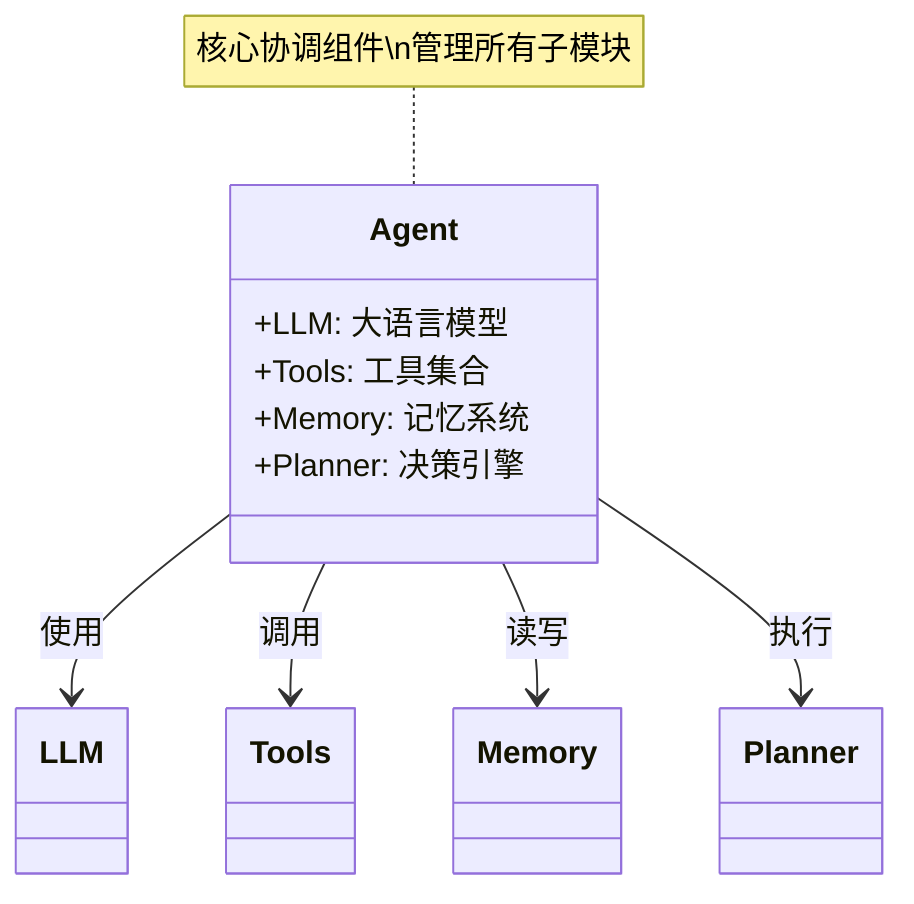
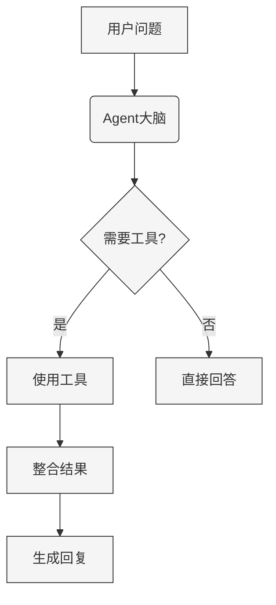
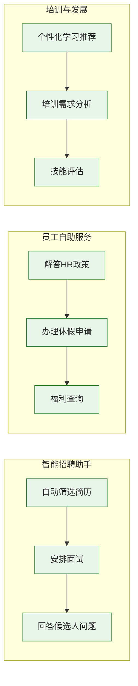

## 什么是大模型Agent？

想象你有一个超级助手，它能理解自然语言、访问各种工具，并能自主完成任务——这就是大模型Agent！Agent = 大语言模型 + 工具使用能力 + 记忆系统 + 决策能力。

### Agent的核心组件：



1. **大脑**：GPT-4等大语言模型
2. **工具**：搜索、计算、数据库访问等能力
3. **记忆**：对话历史和任务上下文
4. **决策**：任务分解和计划能力



## HR领域的Agent应用场景



### 1. 智能招聘助手
- 自动筛选简历
- 安排面试
- 回答候选人问题

### 2. 员工自助服务
- 解答HR政策问题
- 办理休假申请
- 福利查询

### 3. 培训与发展
- 个性化学习推荐
- 培训需求分析
- 技能评估

## Python实战：构建HR问答Agent

### 环境准备
```bash
pip install openai langchain faiss-cpu
```

### 基础问答Agent
```python
from langchain.agents import initialize_agent, Tool
from langchain.llms import OpenAI
from langchain.utilities import GoogleSearchAPIWrapper

# 初始化工具
search = GoogleSearchAPIWrapper()
tools = [
    Tool(
        name="Google Search",
        func=search.run,
        description="用于回答当前HR政策相关问题"
    )
]

# 创建Agent
agent = initialize_agent(
    tools, 
    OpenAI(temperature=0), 
    agent="zero-shot-react-description",
    verbose=True
)

# 提问示例
question = "我们公司今年的年假政策有什么变化？"
response = agent.run(question)
print(f"智能助手回复：{response}")
```

### 简历解析Agent
```python
from langchain.document_loaders import PyPDFLoader
from langchain.indexes import VectorstoreIndexCreator

class ResumeAnalyzer:
    def __init__(self):
        self.index = None
        
    def load_resumes(self, file_paths):
        """加载并索引简历"""
        loaders = [PyPDFLoader(path) for path in file_paths]
        self.index = VectorstoreIndexCreator().from_loaders(loaders)
    
    def query_resumes(self, question):
        """查询简历库"""
        return self.index.query(question)

# 使用示例
analyzer = ResumeAnalyzer()
analyzer.load_resumes(["resume1.pdf", "resume2.pdf"])

# 查找Java开发经验的候选人
results = analyzer.query_resumes("哪些候选人具有5年以上Java开发经验？")
print("符合条件的候选人：", results)
```

## 高级应用：员工入职助手

```python
from langchain.agents import Tool
from langchain.chains import RetrievalQA
from langchain.document_loaders import TextLoader

# 加载公司政策文档
policy_loader = TextLoader("company_policies.txt")
policy_index = VectorstoreIndexCreator().from_loaders([policy_loader])

# 创建工具集
tools = [
    Tool(
        name="政策查询",
        func=lambda q: policy_index.query(q),
        description="用于查询公司政策和规章制度"
    ),
    Tool(
        name="日历管理",
        func=schedule_meeting,  # 假设已实现
        description="用于安排会议和培训"
    )
]

# 入职助手Agent
onboarding_agent = initialize_agent(
    tools,
    OpenAI(model="gpt-4", temperature=0.3),
    agent="conversational-react-description",
    memory=True  # 启用记忆功能
)

# 模拟新员工对话
questions = [
    "我的入职培训什么时候开始？",
    "我需要准备哪些材料？",
    "我的导师是谁？",
    "公司弹性工作制具体怎么执行？"
]

for q in questions:
    print(f"员工：{q}")
    response = onboarding_agent.run(q)
    print(f"助手：{response}\n")
```

## 企业部署注意事项

1. **数据隐私**：确保员工数据加密处理
2. **人工审核**：关键决策需要HR确认
3. **透明性**：告知员工正在与AI交互
4. **持续训练**：定期更新领域知识
5. **评估指标**：设置准确率、满意度等KPI

## 未来展望

1. **多模态Agent**：处理视频面试和图像简历
2. **情感分析**：识别员工满意度
3. **预测分析**：员工离职风险预警
4. **元宇宙集成**：虚拟HR助手

> 大模型Agent不是要取代HR，而是让HR专注于更高价值的工作！

## 学习资源
- [LangChain官方文档](https://langchain.readthedocs.io)
- [HR科技趋势报告](https://example.com/hr-tech-report)
- [AI伦理指南](https://example.com/ai-ethics)



<script type="application/ld+json">
{
  "@context": "https://schema.org",
  "@type": "TechArticle",
  "headline": "大模型Agent开发指南：Python构建HR智能助手完整教程",
  "description": "手把手教你使用Python和LangChain开发HR领域大模型Agent",
  "author": {
    "@type": "Person",
    "name": "KingdeGuo"
  },
  "datePublished": "2025-07-14",
  "keywords": "大语言模型,Agent系统,Python编程,HR科技"
}
</script>
