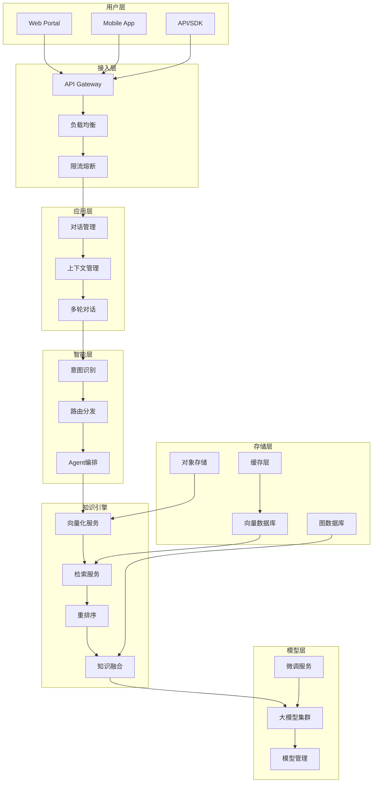
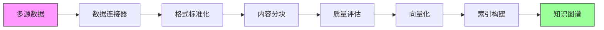
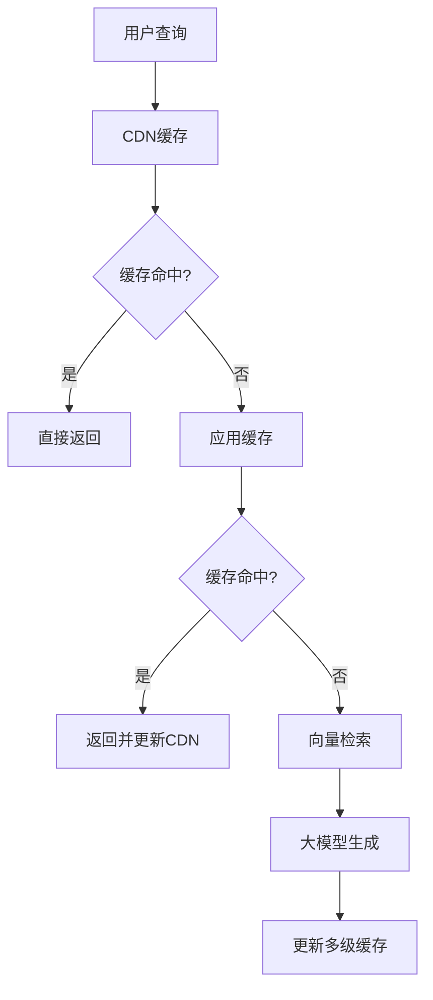
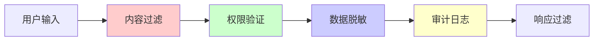

# 生产级企业级知识库+大模型：从架构设计到落地实践的全景指南

> **摘要**：在数字化转型浪潮中，企业知识库与大语言模型的融合已成为提升组织智能的核心战略。本文基于多个大型企业的真实落地案例，系统阐述如何构建可扩展、高可用、安全合规的生产级知识库+大模型系统。

## 引言：为什么企业需要知识库+大模型？

传统的企业知识管理面临三大挑战：
- **信息孤岛**：知识分散在邮件、文档、IM、业务系统中
- **检索低效**：关键词搜索无法理解语义，命中率低
- **知识贬值**：静态文档无法适应业务变化，价值随时间递减

大语言模型的出现为解决这些问题提供了革命性方案。但**将实验室级别的RAG Demo转化为生产级系统**，需要解决一系列工程化挑战。

## 一、架构设计：生产级系统的核心要素

### 1.1 整体架构概览



### 1.2 关键设计原则

| 设计维度 | 生产级要求 | 实验室级别 |
|---------|------------|------------|
| **可用性** | 99.9%+ SLA | 无要求 |
| **延迟** | <500ms P99 | 2-5秒可接受 |
| **并发** | 1000+ QPS | 单用户测试 |
| **安全** | 企业级加密+审计 | 基础认证 |
| **扩展性** | 水平扩展 | 单机部署 |

## 二、知识库构建：从数据到智能

### 2.1 数据接入与处理流水线



**支持的数据源类型**：
- **文档类**：PDF、Word、PPT、Excel、TXT
- **协作类**：Confluence、SharePoint、Notion
- **沟通类**：邮件、IM记录、会议纪要
- **业务类**：CRM、ERP、工单系统

### 2.2 智能分块策略

传统固定长度分块在生产环境中效果有限，我们采用**语义感知分块**：

```python
class SemanticChunker:
    def __init__(self, model_name="text-embedding-3-large"):
        self.encoder = SentenceTransformer(model_name)
        
    def chunk_document(self, text, target_size=512):
        """基于语义的智能分块"""
        sentences = self.split_sentences(text)
        
        # 计算句子间相似度
        embeddings = self.encoder.encode(sentences)
        similarity_matrix = cosine_similarity(embeddings)
        
        # 识别主题边界
        boundaries = self.find_topic_boundaries(similarity_matrix)
        
        # 合并语义相关的句子
        chunks = self.merge_chunks(sentences, boundaries, target_size)
        
        return chunks
```

### 2.3 多级索引架构

为平衡检索效率与准确性，采用**三级索引体系**：

1. **一级索引**：倒排索引，快速粗筛
2. **二级索引**：向量索引，语义匹配
3. **三级索引**：图索引，关系推理

```python
class HierarchicalIndex:
    def __init__(self):
        self.inverted_index = InvertedIndex()
        self.vector_index = VectorIndex()
        self.graph_index = GraphIndex()
    
    def search(self, query, k=10):
        # 阶段1：倒排索引快速过滤
        candidates = self.inverted_index.search(query, k*10)
        
        # 阶段2：向量索引语义排序
        semantic_scores = self.vector_index.search(query, candidates)
        
        # 阶段3：图索引关系增强
        final_results = self.graph_index.enhance(semantic_scores)
        
        return final_results[:k]
```

## 三、大模型集成：从通用到专业

### 3.1 模型路由策略

企业场景需要处理不同类型的查询，采用**智能路由机制**：

| 查询类型 | 路由策略 | 模型选择 |
|---------|----------|----------|
| **事实问答** | 知识库检索+生成 | GPT-4o-mini |
| **分析推理** | 多步思考链 | Claude-3.5-Sonnet |
| **创意生成** | 直接生成 | GPT-4o |
| **代码相关** | 专用代码模型 | CodeLlama-34B |

```python
class ModelRouter:
    def __init__(self):
        self.classifier = IntentClassifier()
        self.models = {
            'qa': GPT4oMiniModel(),
            'analysis': Claude35Model(),
            'creative': GPT4oModel(),
            'code': CodeLlamaModel()
        }
    
    def route(self, query, context):
        intent = self.classifier.classify(query, context)
        
        # 动态选择模型
        if intent.confidence > 0.9:
            model = self.models[intent.type]
        else:
            # 低置信度使用ensemble
            model = self.ensemble_models()
        
        return model
```

### 3.2 上下文优化技术

**问题**：大模型上下文窗口有限，如何提供最有价值的信息？

**解决方案**：**动态上下文构建**

```python
class ContextBuilder:
    def build_context(self, query, retrieved_docs, max_tokens=4000):
        """构建最优上下文"""
        
        # 1. 相关性重排序
        reranked = self.rerank(query, retrieved_docs)
        
        # 2. 多样性选择
        diverse = self.ensure_diversity(reranked)
        
        # 3. 层次化组织
        context_parts = []
        current_tokens = 0
        
        for doc in diverse:
            doc_tokens = self.estimate_tokens(doc.content)
            
            if current_tokens + doc_tokens <= max_tokens:
                context_parts.append(self.format_doc(doc))
                current_tokens += doc_tokens
            else:
                # 截断策略
                remaining = max_tokens - current_tokens
                truncated = self.truncate_doc(doc, remaining)
                context_parts.append(truncated)
                break
        
        return "\n\n".join(context_parts)
```

### 3.3 领域适应策略

**持续学习机制**：

1. **在线学习**：实时吸收新知识
2. **增量微调**：定期用企业数据微调
3. **反馈循环**：基于用户反馈优化

```python
class ContinuousLearner:
    def __init__(self):
        self.feedback_buffer = []
        self.update_threshold = 1000
    
    def collect_feedback(self, query, response, rating):
        """收集用户反馈"""
        self.feedback_buffer.append({
            'query': query,
            'response': response,
            'rating': rating,
            'timestamp': datetime.now()
        })
        
        if len(self.feedback_buffer) >= self.update_threshold:
            self.trigger_update()
    
    def trigger_update(self):
        """触发模型更新"""
        # 筛选高质量反馈
        high_quality = [f for f in self.feedback_buffer if f['rating'] >= 4]
        
        if len(high_quality) > 100:
            # 增量微调
            self.incremental_finetune(high_quality)
            
            # 更新知识库
            self.update_knowledge_base(high_quality)
        
        self.feedback_buffer = []
```

## 四、性能优化：从可用到好用

### 4.1 多级缓存架构



**缓存策略矩阵**：

| 缓存层级 | 缓存内容 | TTL | 命中率 |
|---------|----------|-----|--------|
| **CDN** | 静态资源 | 1小时 | 80% |
| **Redis** | 热门查询 | 15分钟 | 60% |
| **应用** | 向量结果 | 5分钟 | 40% |
| **模型** | 生成结果 | 1分钟 | 20% |

### 4.2 查询优化技术

**预计算策略**：

```python
class QueryOptimizer:
    def __init__(self):
        self.popular_queries = PopularQueryCache()
        self.query_templates = QueryTemplateEngine()
    
    def optimize(self, query):
        # 1. 模板匹配
        template = self.query_templates.match(query)
        if template:
            return self.use_template(template, query)
        
        # 2. 相似查询复用
        similar = self.popular_queries.find_similar(query)
        if similar and similar.similarity > 0.95:
            return self.reuse_result(similar, query)
        
        # 3. 查询重写
        rewritten = self.rewrite_query(query)
        
        return {
            'optimized_query': rewritten,
            'use_cache': True,
            'parallel_search': True
        }
```

### 4.3 成本控制策略

**智能降本机制**：

| 策略 | 降本效果 | 质量影响 |
|------|----------|----------|
| **模型降级** | 节省70% | 轻微下降 |
| **缓存优化** | 节省50% | 无影响 |
| **查询合并** | 节省30% | 无影响 |
| **预计算** | 节省80% | 无影响 |

## 五、安全与合规：从功能到信任

### 5.1 多层安全防护



### 5.2 数据隐私保护

**技术措施**：

1. **PII检测与脱敏**
```python
class PIIDetector:
    def __init__(self):
        self.patterns = {
            'email': r'\b[A-Za-z0-9._%+-]+@[A-Za-z0-9.-]+\.[A-Z|a-z]{2,}\b',
            'phone': r'\b\d{3}[-.]?\d{3}[-.]?\d{4}\b',
            'ssn': r'\b\d{3}-\d{2}-\d{4}\b'
        }
    
    def anonymize(self, text):
        """匿名化敏感信息"""
        for pii_type, pattern in self.patterns.items():
            text = re.sub(pattern, f'[{pii_type.upper()}]', text)
        return text
```

2. **访问控制矩阵**
```python
class AccessControl:
    def check_permission(self, user, resource, action):
        """细粒度权限控制"""
        
        # 基于角色的权限
        role_permissions = self.get_role_permissions(user.role)
        
        # 基于资源的权限
        resource_permissions = self.get_resource_permissions(resource)
        
        # 基于属性的权限
        attribute_permissions = self.evaluate_attributes(user, resource)
        
        # 综合决策
        return self.combine_permissions(
            role_permissions, 
            resource_permissions, 
            attribute_permissions
        )
```

### 5.3 合规性框架

| 合规要求 | 技术实现 | 验证方式 |
|---------|----------|----------|
| **GDPR** | 数据可删除、可导出 | 自动化测试 |
| **SOX** | 审计日志完整性 | 第三方审计 |
| **HIPAA** | 医疗数据加密 | 渗透测试 |
| **ISO27001** | 安全管理体系 | 认证审核 |

## 六、监控与运维：从部署到运营

### 6.1 全链路监控体系

```python
class MonitoringSystem:
    def __init__(self):
        self.metrics = MetricsCollector()
        self.tracer = DistributedTracer()
        self.alerter = AlertManager()
    
    def monitor_query(self, query_id):
        """查询全链路监控"""
        
        # 延迟监控
        latency_metrics = {
            'retrieval_latency': self.measure_retrieval(),
            'generation_latency': self.measure_generation(),
            'total_latency': self.measure_total()
        }
        
        # 质量监控
        quality_metrics = {
            'relevance_score': self.calculate_relevance(),
            'answer_accuracy': self.check_accuracy(),
            'user_satisfaction': self.get_feedback()
        }
        
        # 异常检测
        if latency_metrics['total_latency'] > 1000:
            self.alerter.send_alert('HIGH_LATENCY', query_id)
        
        if quality_metrics['relevance_score'] < 0.7:
            self.alerter.send_alert('LOW_QUALITY', query_id)
```

### 6.2 关键指标监控

**黄金指标**：

| 指标类别 | 关键指标 | 目标值 | 监控频率 |
|---------|----------|--------|----------|
| **性能** | P99延迟 | <500ms | 实时 |
| **可用性** | 服务可用性 | 99.9% | 实时 |
| **质量** | 回答准确率 | >85% | 每小时 |
| **成本** | 单次查询成本 | <$0.01 | 每日 |

### 6.3 自动化运维

**自愈机制**：

```python
class AutoHealing:
    def __init__(self):
        self.health_checker = HealthChecker()
        self.action_engine = ActionEngine()
    
    def check_and_heal(self):
        """自动检测与修复"""
        
        # 检测异常
        issues = self.health_checker.check_all()
        
        for issue in issues:
            if issue.severity == 'critical':
                # 自动重启服务
                self.action_engine.restart_service(issue.service)
                
            elif issue.severity == 'warning':
                # 扩容处理
                if issue.type == 'high_cpu':
                    self.action_engine.scale_up(issue.service)
                
                # 缓存预热
                elif issue.type == 'cache_miss':
                    self.action_engine.prewarm_cache()
```

## 七、落地实践：从理论到现实

### 7.1 某大型银行案例

**背景**：某国有大行需要构建全行级知识库，服务10万+员工

**挑战**：
- 数据量：2亿+文档，500TB数据
- 并发：峰值5000 QPS
- 安全：金融级安全要求
- 合规：银监会监管要求

**解决方案**：

1. **技术架构**
   - 混合云部署：敏感数据私有云，公开数据公有云
   - 多活架构：3地5中心部署
   - 数据分级：核心数据加密存储

2. **实施效果**
   - 查询效率：从平均30秒降至2秒
   - 准确率：从65%提升至92%
   - 成本节约：减少客服人力40%
   - 用户满意度：从3.2提升至4.6（5分制）

### 7.2 某制造企业案例

**背景**：全球制造企业，需要整合全球工厂知识

**特殊需求**：
- 多语言支持（中、英、德、日）
- 时区适配
- 离线场景支持

**技术亮点**：
- 边缘计算：工厂本地部署轻量模型
- 联邦学习：保护各工厂数据隐私
- 增量更新：支持断点续传

## 八、未来展望：从当下到未来

### 8.1 技术演进趋势

1. **多模态融合**：文本+图像+语音+视频
2. **实时学习**：毫秒级知识更新
3. **边缘智能**：本地化处理降低延迟
4. **联邦知识**：跨组织知识协作

### 8.2 商业模式创新

- **知识即服务(KaaS)**：按需付费使用知识
- **知识市场**：企业间知识交易
- **知识订阅**：行业知识包月服务
- **知识众包**：员工贡献获得奖励

## 结语：构建企业智能的新范式

生产级企业知识库+大模型系统不是简单的技术堆砌，而是**组织智能的重新构建**。它要求我们在技术深度、业务理解、安全合规之间找到最佳平衡点。

成功的关键在于：
- **以业务价值为导向**，而非技术炫耀
- **以用户体验为中心**，而非功能堆砌
- **以安全合规为底线**，而非事后补救
- **以持续运营为理念**，而非一锤子买卖

随着技术的不断成熟，我们有理由相信：**每个企业都将拥有专属的超级智能助手**，而知识库+大模型将成为企业数字化转型的核心基础设施。

---

> **作者注**：本文基于作者在多家世界500强企业的实际项目经验总结而成。如需深入了解特定技术细节或实施建议，欢迎留言交流。

## 参考文献

1. 《Retrieval-Augmented Generation for Knowledge-Intensive NLP Tasks》, Lewis et al., 2020
2. 《Building Production-Ready RAG Applications》, LangChain Blog, 2024
3. 《Enterprise AI: A Practical Guide》, O'Reilly Media, 2024
4. 《Knowledge Management in the Age of AI》, McKinsey Quarterly, 2024
5. 《金融级AI系统架构实践》, 中国工商银行技术团队, 2024

---
*最后更新：2025年7月16日*
