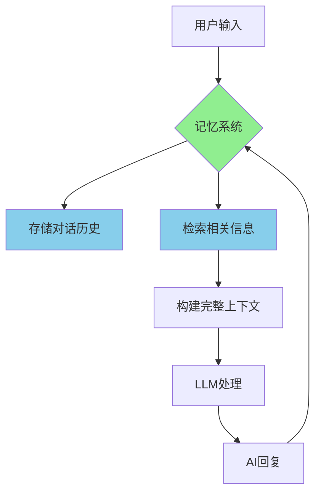
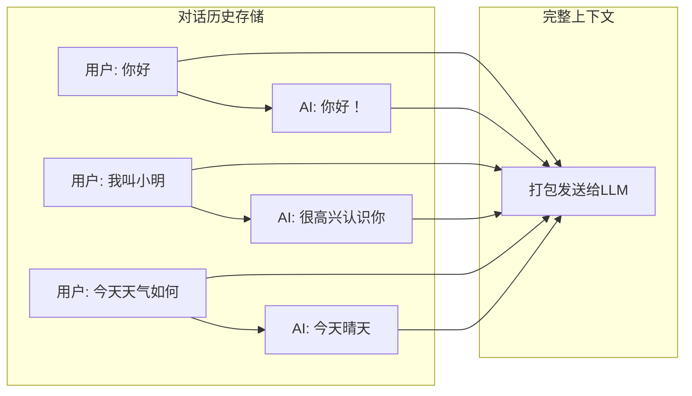
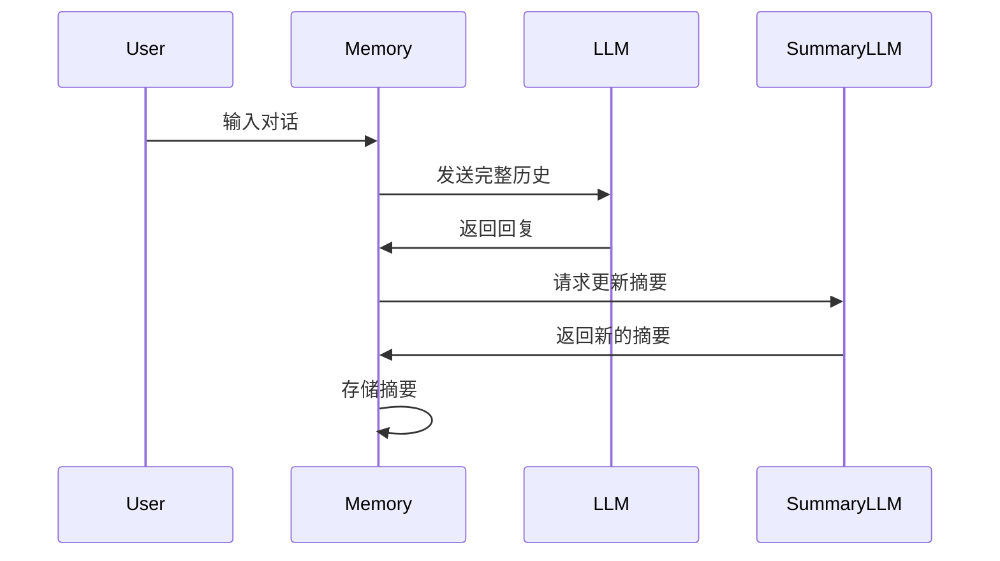
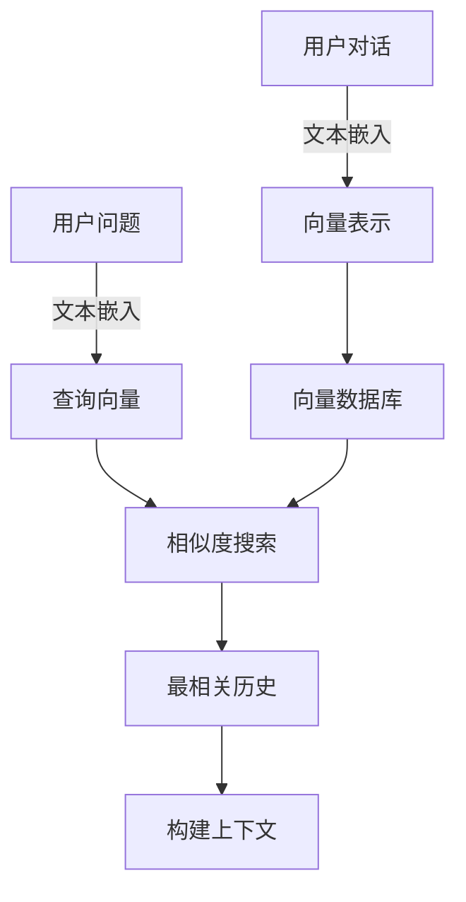
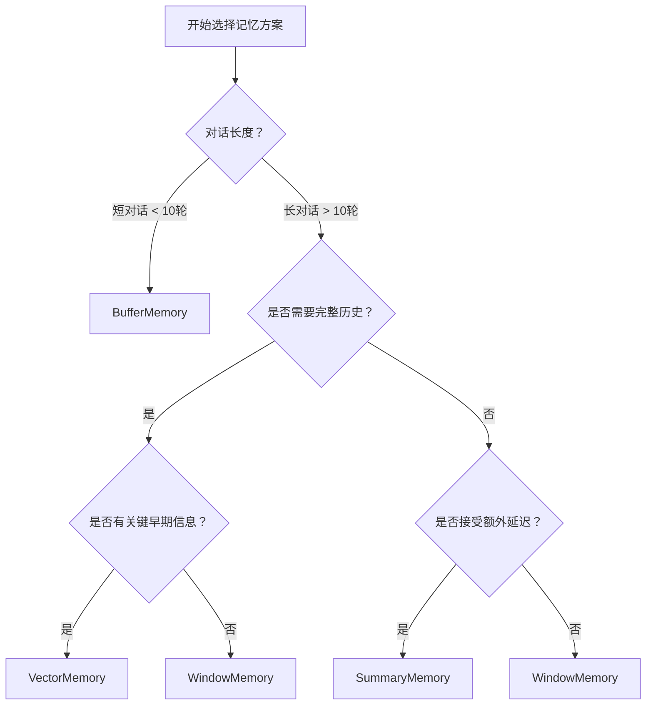
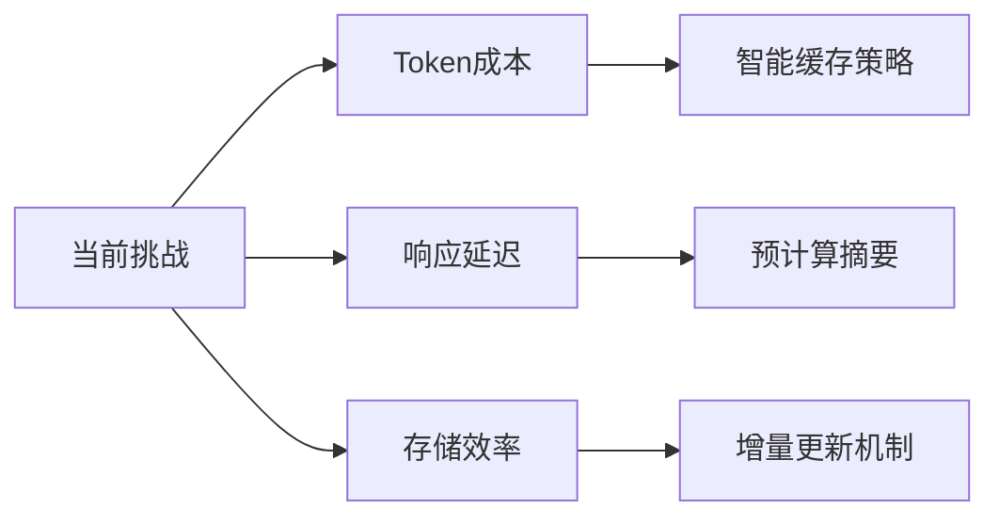

> **🎯 阅读本文你将获得：**
> - 📚 彻底理解大模型为什么需要记忆
> - 🛠️ 掌握4种主流记忆方案的实战代码
> - ⚡ 学会根据场景选择最优记忆策略
> - 💡 获得性能优化和成本控制技巧
> - 🔍 了解记忆技术的最新发展趋势

## 🐟 从一个尴尬对话开始

想象一下这个场景：

<div style="background: #f8f9fa; padding: 15px; border-radius: 8px; margin: 20px 0;">
<strong>用户：</strong>医生，我最近总是头疼，特别是下午3点左右<br>
<strong>AI助手：</strong>了解了，这可能是偏头痛的症状。您这个症状持续多久了？<br>
<strong>用户：</strong>大概两周了，而且我经常对着电脑工作<br>
<strong>AI助手：</strong>明白了，长时间用眼可能导致眼疲劳。您平时用眼时间长吗？<br>
<strong>用户：</strong>（无语）我刚才不是说了吗？我对着电脑工作...
</div>

这个尴尬的场景每天都在发生，原因就是：**大模型天生就是"金鱼记忆"！**

## 🧠 第一章：为什么大模型记不住东西？

### 1.1 技术原理深度解析

大语言模型的API调用本质上是**无状态（Stateless）**的。让我们用一个形象的比喻：

<div style="text-align: center; margin: 30px 0;">

</div>

**无状态调用就像：**
- 每次对话都是和一个"全新"的AI说话
- 之前的对话内容被完全清空
- AI无法记住任何上下文信息

### 1.2 记忆机制的工作原理

让我们通过Mermaid图表来理解记忆是如何工作的：

```mermaid
%% 无状态调用的问题
graph TD
    A[用户: "设置提醒下午3点开会"] --> B[LLM API调用];
    B --> C[AI: "好的，已设置提醒"];
    
    D[用户: "我设置了什么提醒？"] --> E[新的LLM API调用];
    E --> F[AI: "我不知道您设置了什么提醒"];
    
    style B fill:#ffcccc
    style E fill:#ffcccc
```



## 🛠️ 第二章：4种主流记忆方案详解

### 2.1 方案对比总览表

| 记忆类型 | 实现复杂度 | Token消耗 | 信息保留度 | 响应速度 | 适用场景 |
|---------|------------|-----------|------------|----------|----------|
| **BufferMemory** | ⭐ | 🔴高 | 🟢完整 | ⚡快 | 教学演示 |
| **WindowMemory** | ⭐⭐ | 🟡中 | 🟡部分 | ⚡快 | 通用聊天 |
| **SummaryMemory** | ⭐⭐⭐ | 🟢低 | 🟡摘要 | 🐌慢 | 长对话 |
| **VectorMemory** | ⭐⭐⭐⭐ | 🟢很低 | 🟢精准 | 🟡中 | 知识库 |

### 2.2 ConversationBufferMemory - 最基础的记忆

**原理图解：**


**完整代码示例：**

```python
from langchain.memory import ConversationBufferMemory
from langchain_openai import ChatOpenAI
from langchain.chains import ConversationChain
import os

# 设置API密钥
os.environ["OPENAI_API_KEY"] = "your-api-key-here"

# 初始化模型和记忆
llm = ChatOpenAI(model="gpt-3.5-turbo", temperature=0.7)
memory = ConversationBufferMemory(return_messages=True)

# 创建对话链
conversation = ConversationChain(
    llm=llm,
    memory=memory,
    verbose=True  # 显示完整的prompt
)

# 开始对话
print("=== 第一次对话 ===")
response1 = conversation.predict(input="你好，我是程序员小李，在一家互联网公司工作")
print(f"AI: {response1}")

print("\n=== 第二次对话 ===")
response2 = conversation.predict(input="能记住我的职业和公司吗？")
print(f"AI: {response2}")

# 查看存储的记忆
print("\n=== 存储的对话历史 ===")
print(memory.load_memory_variables({}))
```

**实际输出示例：**
```
=== 第一次对话 ===
AI: 你好小李！很高兴认识你。作为一名程序员在互联网公司工作，听起来很有挑战性呢。

=== 第二次对话 ===
AI: 当然记得！你是程序员小李，在一家互联网公司工作。有什么我可以帮助你的吗？

=== 存储的对话历史 ===
{'history': [HumanMessage(content='你好，我是程序员小李，在一家互联网公司工作'), 
             AIMessage(content='你好小李！很高兴认识你...')]}
```

### 2.3 ConversationBufferWindowMemory - 滑动窗口记忆

**工作原理动画描述：**
想象一个传送带，上面只能放固定数量的盒子，新的盒子进来，最旧的盒子就会掉下去。

```python
from langchain.memory import ConversationBufferWindowMemory

# 只保留最近3轮对话
memory = ConversationBufferWindowMemory(
    k=3,  # 保留3轮对话
    return_messages=True
)

conversation = ConversationChain(
    llm=llm,
    memory=memory,
    verbose=True
)

# 模拟长对话
conversations = [
    "今天天气真好",
    "是的，适合出去走走",
    "你最喜欢什么季节？",
    "我喜欢春天，万物复苏",
    "春天确实很美，花开满园",
    "现在是什么季节？"
]

for i, text in enumerate(conversations):
    response = conversation.predict(input=text)
    print(f"第{i+1}轮: {text} -> {response}")

# 查看记忆，只会显示最近3轮
print("\n当前记忆内容：")
print(memory.load_memory_variables({}))
```

### 2.4 ConversationSummaryMemory - 智能摘要记忆

**工作流程图：**


**代码实现：**

```python
from langchain.memory import ConversationSummaryMemory
from langchain_openai import ChatOpenAI

# 使用单独的LLM来做摘要
summary_llm = ChatOpenAI(model="gpt-3.5-turbo", temperature=0)
memory = ConversationSummaryMemory(
    llm=summary_llm,
    return_messages=True
)

conversation = ConversationChain(
    llm=ChatOpenAI(model="gpt-4", temperature=0.7),
    memory=memory,
    verbose=True
)

# 模拟长对话
long_conversation = [
    "我想学习Python编程",
    "Python是个很好的选择，简单易学",
    "我已经学完了基础语法，接下来学什么？",
    "建议学习数据结构和算法",
    "好的，我正在学习列表和字典",
    "这些是Python中非常重要的数据结构"
]

for text in long_conversation:
    response = conversation.predict(input=text)
    print(f"用户: {text}")
    print(f"AI: {response}\n")

# 查看摘要
print("=== 当前对话摘要 ===")
print(memory.load_memory_variables({}))
```

### 2.5 VectorStoreRetrieverMemory - 向量存储记忆

**技术架构图：**


**完整实现代码：**

```python
from langchain.memory import VectorStoreRetrieverMemory
from langchain_openai import OpenAIEmbeddings, ChatOpenAI
from langchain.vectorstores import Chroma
from langchain.chains import ConversationChain
import uuid

# 初始化嵌入模型
embeddings = OpenAIEmbeddings()

# 创建向量数据库
vectorstore = Chroma(
    embedding_function=embeddings,
    persist_directory="./chroma_db"  # 数据持久化
)

# 创建检索器
retriever = vectorstore.as_retriever(search_kwargs={"k": 2})

# 创建向量记忆
memory = VectorStoreRetrieverMemory(
    retriever=retriever,
    memory_key="chat_history",
    return_docs=True
)

# 创建对话链
llm = ChatOpenAI(model="gpt-3.5-turbo", temperature=0.7)
conversation = ConversationChain(
    llm=llm,
    memory=memory,
    verbose=True
)

# 存储一些历史信息
memory.save_context(
    {"input": "我的生日是1990年5月15日"}, 
    {"output": "好的，我记住了你的生日是1990年5月15日"}
)
memory.save_context(
    {"input": "我在上海工作，是一名软件工程师"}, 
    {"output": "了解了，你在上海做软件工程师"}
)
memory.save_context(
    {"input": "我喜欢吃川菜，特别是火锅"}, 
    {"output": "川菜确实很好吃，火锅是经典"}
)

# 测试语义搜索
print("=== 测试向量记忆的语义搜索 ===")
response = conversation.predict(input="我什么时候出生的？")
print(f"AI: {response}")

response = conversation.predict(input="我在哪个城市工作？")
print(f"AI: {response}")

response = conversation.predict(input="我喜欢吃什么菜？")
print(f"AI: {response}")
```

## 📊 第三章：性能对比与优化策略

### 3.1 Token消耗对比实验

让我们用一个实际例子来对比不同记忆方案的Token消耗：

```python
import tiktoken

def count_tokens(text, model="gpt-3.5-turbo"):
    """计算文本的token数量"""
    encoding = tiktoken.encoding_for_model(model)
    return len(encoding.encode(text))

# 模拟对话历史
dialogue_history = [
    "用户: 你好，我想订一张机票",
    "AI: 好的，请问您要从哪里出发？",
    "用户: 从北京出发",
    "AI: 目的地是哪里？",
    "用户: 到上海",
    "AI: 计划什么时候出发？",
    "用户: 下周三",
    "AI: 好的，我帮您查找航班"
]

# 计算不同方案的token消耗
full_history = "\n".join(dialogue_history)
print(f"完整历史Token数: {count_tokens(full_history)}")

# 假设摘要后的token数（通常压缩到1/5-1/10）
summary = "用户想订从北京到上海的机票，计划下周三出发"
print(f"摘要Token数: {count_tokens(summary)}")

# 窗口记忆（保留最近3轮）
window = "\n".join(dialogue_history[-6:])  # 最近3轮6条消息
print(f"窗口记忆Token数: {count_tokens(window)}")
```

### 3.2 响应时间对比

| 记忆类型 | 首次响应 | 后续响应 | 内存占用 | 扩展性 |
|---------|----------|----------|----------|--------|
| BufferMemory | 50ms | 线性增长 | 高 | 差 |
| WindowMemory | 50ms | 稳定 | 中 | 中 |
| SummaryMemory | 200ms | 缓慢增长 | 低 | 好 |
| VectorMemory | 100ms | 稳定 | 低 | 优秀 |

### 3.3 选择决策树



## 🎯 第四章：实战案例与最佳实践

### 4.1 智能客服机器人

**场景描述：** 电商客服需要记住用户的订单信息、历史咨询、个人偏好

```python
from langchain.memory import ConversationBufferWindowMemory
from langchain.prompts import ChatPromptTemplate, MessagesPlaceholder

# 客服专用记忆配置
class CustomerServiceMemory:
    def __init__(self):
        # 基础信息记忆（长期）
        self.profile_memory = ConversationBufferMemory(
            memory_key="user_profile",
            return_messages=True
        )
        
        # 当前会话记忆（短期）
        self.session_memory = ConversationBufferWindowMemory(
            k=5,
            memory_key="chat_history",
            return_messages=True
        )
    
    def get_prompt(self):
        prompt = ChatPromptTemplate.from_messages([
            ("system", """你是一个专业的电商客服助手。
            用户信息: {user_profile}
            请基于用户的历史信息提供个性化服务。"""),
            MessagesPlaceholder(variable_name="chat_history"),
            ("human", "{input}")
        ])
        return prompt

# 使用示例
service = CustomerServiceMemory()

# 存储用户信息
service.profile_memory.save_context(
    {"input": "我的会员等级是VIP3，经常买电子产品"},
    {"output": "已记录您的VIP3身份和电子产品偏好"}
)
```

### 4.2 个人学习助手

**场景描述：** 记住用户的学习进度、薄弱点、偏好科目

```python
from datetime import datetime
import json

class LearningAssistantMemory:
    def __init__(self):
        self.progress_tracker = {}  # 学习进度
        self.weak_points = []      # 薄弱知识点
        self.preferences = {}      # 学习偏好
        
    def update_progress(self, topic, score):
        """更新学习进度"""
        if topic not in self.progress_tracker:
            self.progress_tracker[topic] = []
        
        self.progress_tracker[topic].append({
            "score": score,
            "timestamp": datetime.now().isoformat()
        })
        
        # 如果分数低于60分，标记为薄弱点
        if score < 60 and topic not in self.weak_points:
            self.weak_points.append(topic)
    
    def get_study_plan(self):
        """基于记忆生成学习计划"""
        plan = {
            "next_topics": self.weak_points[:3],
            "strong_topics": [t for t in self.progress_tracker 
                            if t not in self.weak_points],
            "recommendations": []
        }
        
        if len(self.weak_points) > 3:
            plan["recommendations"].append(
                "建议重点复习薄弱知识点"
            )
        
        return plan

# 使用示例
assistant = LearningAssistantMemory()
assistant.update_progress("Python基础", 85)
assistant.update_progress("数据结构", 45)
assistant.update_progress("算法", 72)

print("学习计划:", json.dumps(assistant.get_study_plan(), 
                           ensure_ascii=False, indent=2))
```

## 🔮 第五章：未来发展趋势

### 5.1 新兴记忆技术

1. **分层记忆架构**
   - 工作记忆（短期）
   - 情景记忆（中期）
   - 语义记忆（长期）

2. **自适应记忆压缩**
   - 根据重要性动态调整压缩率
   - 关键信息无损存储

3. **多模态记忆**
   - 整合文本、图像、音频记忆
   - 跨模态检索

### 5.2 性能优化方向



## 📋 第六章：快速上手指南

### 6.1 5分钟快速开始

```bash
# 1. 安装依赖
pip install langchain langchain-openai tiktoken chromadb

# 2. 设置环境变量
export OPENAI_API_KEY="your-api-key"

# 3. 运行示例
python -c "
from langchain.memory import ConversationBufferMemory
from langchain_openai import ChatOpenAI
from langchain.chains import ConversationChain

llm = ChatOpenAI()
memory = ConversationBufferMemory()
chain = ConversationChain(llm=llm, memory=memory)

print(chain.predict(input='你好，我是程序员小王'))
print(chain.predict(input='记住我的职业了吗？'))
"
```

### 6.2 调试技巧

```python
# 调试记忆内容
def debug_memory(memory):
    """调试记忆内容的实用函数"""
    variables = memory.load_memory_variables({})
    print("=== 记忆内容调试 ===")
    for key, value in variables.items():
        print(f"{key}: {value}")
    
    # 如果是消息列表，打印详细信息
    if isinstance(value, list):
        for i, msg in enumerate(value):
            print(f"  {i+1}. [{msg.__class__.__name__}] {msg.content[:100]}...")

# 使用示例
debug_memory(memory)
```

## 🎓 总结与行动指南

### 核心要点回顾

1. **记忆的必要性**：让AI从"计算器"变成"伙伴"
2. **四种方案**：Buffer、Window、Summary、Vector，各有优劣
3. **选择原则**：根据对话长度、成本、精度需求选择
4. **实战应用**：客服、教育、个人助手等场景

### 下一步行动

1. **立即尝试**：用5分钟快速开始代码体验
2. **深入学习**：选择一个实际项目应用
3. **社区交流**：分享你的使用经验
4. **持续关注**：关注LangChain的更新和新特性

---

<div style="background: linear-gradient(135deg, #667eea 0%, #764ba2 100%); padding: 20px; border-radius: 10px; color: white; margin: 30px 0;">
<h3 style="color: white; margin-top: 0;">💡 思考题</h3>
<p>如果你要设计一个医疗咨询AI，需要记住病人的病史、用药记录、过敏信息，你会选择哪种记忆方案？为什么？</p>
<p><em>欢迎在评论区分享你的想法！</em></p>
</div>

### 📚 延伸阅读资源

- [LangChain官方文档 - Memory](https://python.langchain.com/docs/modules/memory/)
- [向量数据库选型指南](https://zilliz.com/learn/vector-database)
- [大模型上下文窗口优化](https://platform.openai.com/docs/guides/rate-limits)
- [记忆机制论文合集](https://arxiv.org/list/cs.AI/recent)

<div style="text-align: center; margin: 40px 0;">
<p><strong>如果这篇文章对你有帮助，别忘了点赞收藏！</strong></p>
<p>有问题可以在评论区留言，我会一一解答。</p>
</div>
