> **🎯 阅读本文你将获得：**
> - 🧠 理解大模型记忆的本质和限制
> - 🔍 掌握RAG技术的完整实现流程
> - 💾 学会构建长期记忆系统
> - ⚡ 获得优化大模型记忆的实用技巧
> - 🛠️ 完整的项目实战经验

## 📋 目录
- [第一章：大模型记忆问题的现实挑战](#第一章大模型记忆问题的现实挑战)
- [第二章：大模型记忆机制基础概念](#第二章大模型记忆机制基础概念)
- [第三章：上下文窗口-大模型的短期记忆](#第三章上下文窗口-大模型的短期记忆)
- [第四章：RAG技术-外部记忆系统](#第四章rag技术-外部记忆系统)
- [第五章：长期记忆-从会话到持久化](#第五章长期记忆-从会话到持久化)
- [第六章：实战-构建智能记忆系统](#第六章实战-构建智能记忆系统)
- [第七章：未来展望与技术趋势](#第七章未来展望与技术趋势)

## 第一章：大模型记忆问题的现实挑战

在日常使用ChatGPT、Claude等大模型时，你是否遇到过这些令人困扰的场景？

> **真实场景**：你正在与AI助手讨论一个复杂的项目架构，对话已经进行了30分钟，涉及技术选型、数据库设计、API规范等多个话题。突然，AI开始重复之前已经确认过的技术方案，甚至忘记了你们已经否决的架构选择...
>
> **痛点问题**：大模型的"健忘症"严重影响了长对话的质量和效率
>
> **传统方案**：不断重复上下文、分段对话、人工总结
>
> **期望效果**：AI能够像人类一样记住长对话的所有细节，提供连贯的个性化服务

让我们通过一个具体的例子来理解这个问题：

```python
# 模拟大模型对话中的记忆问题
class SimpleLLMChat:
    def __init__(self, max_context=4096):
        self.max_context = max_context
        self.conversation = []
    
    def add_message(self, role, content):
        """添加消息到对话历史"""
        self.conversation.append({"role": role, "content": content})
        
        # 模拟上下文窗口限制
        total_tokens = sum(len(msg["content"]) for msg in self.conversation)
        while total_tokens > self.max_context and len(self.conversation) > 2:
            self.conversation.pop(0)  # 移除最早的消息
            total_tokens = sum(len(msg["content"]) for msg in self.conversation)
    
    def get_context(self):
        """获取当前上下文"""
        return self.conversation

# 演示记忆限制
chat = SimpleLLMChat(max_context=1000)  # 模拟4K上下文

# 模拟长对话
topics = [
    "项目背景：构建一个分布式电商平台",
    "技术选型：Spring Cloud vs Kubernetes",
    "数据库设计：MySQL分库分表策略",
    "缓存方案：Redis集群架构",
    "消息队列：Kafka vs RabbitMQ选择",
    "监控告警：Prometheus+Grafana",
    "日志收集：ELK Stack配置",
    "安全认证：JWT Token设计"
]

for topic in topics:
    chat.add_message("user", topic)
    chat.add_message("assistant", f"关于{topic}的详细分析...")

print(f"对话轮次: {len(chat.conversation) // 2}")
print(f"保留的话题: {[msg['content'][:20] + '...' for msg in chat.conversation[::2]]}")
```

运行结果：
```
对话轮次: 4
保留的话题: ['监控告警：Prometheus...', '安全认证：JWT Token...', '项目背景：构建一个分...', '技术选型：Spring Cl...']
```

可以看到，由于上下文限制，最早讨论的项目背景和技术选型信息已经被"遗忘"了。

**本章要点**：
- ✅ 理解了大模型"健忘"的根本原因：上下文窗口限制
- ✅ 认识到传统方案的局限性：重复、低效、不智能
- ✅ 明确了构建记忆系统的必要性：提升长对话质量

## 第二章：大模型记忆机制基础概念

### 2.1 神经网络记忆的本质

大语言模型的记忆主要体现在两个层面：

<div class="phoenix-chart-container" data-chart='{"type":"mermaid","code":"graph TD\n    A[模型权重] --> B(长期知识存储)\n    C[上下文窗口] --> D(短期记忆)\n    E[外部向量存储] --> F(扩展记忆)\n    G[知识图谱] --> F\n    style A fill:#4ECDC4\n    style C fill:#45B7D1\n    style E fill:#96CEB4\n    style G fill:#FFEEAD"}'></div>

### 2.2 记忆的分类

| 记忆类型 | 存储位置 | 容量 | 持久性 | 访问速度 | 典型应用 |
|---------|---------|-----|--------|---------|----------|
| **权重记忆** | 模型参数 | 固定 | 永久 | 快速 | 通用知识问答 |
| **上下文记忆** | 输入序列 | 有限 | 临时 | 快速 | 多轮对话 |
| **向量记忆** | 向量数据库 | 可扩展 | 持久 | 中等 | 专业知识检索 |
| **图谱记忆** | 知识图谱 | 结构化 | 持久 | 慢 | 关系推理 |

### 2.3 记忆限制的数学表示

$$ \text{有效记忆长度} = \min(\text{上下文窗口长度}, \frac{\text{模型参数量}}{\text{信息密度}}) $$

这个公式表明：
- 有效记忆长度受限于上下文窗口的物理限制
- 模型参数量越大，理论上能存储的知识越<div class="phoenix-chart-container" data-chart='{"type":"mermaid","code":"graph TD\n    subgraph \"记忆层次结构\"\n        subgraph \"核心记忆\"\n            PM[模型权重<br/>长期存储]\n        end\n        \n        subgraph \"短期记忆\"\n            CM[上下文窗口<br/>临时存储]\n        end\n        \n        subgraph \"扩展记忆\"\n            EM[向量数据库<br/>长期存储]\n            KB[知识图谱<br/>结构化记忆]\n        end\n    end\n    \n    User[用户输入] --> CM\n    CM --> |推理| PM\n    CM --> |检索| EM\n    EM --> |增强| CM\n    KB --> |补充| EM\n    \n    style PM fill:#e1f5fe\n    style CM fill:#fff3e0\n    style EM fill:#f3e5f5\n    style KB fill:#d1c4e9"}'></div> style CM fill:#fff3e0
    style EM fill:#f3e5f5
    style KB fill:#d1c4e9
```

## 第三章：上下文窗口-大模型的短期记忆

### 3.1 Transformer注意力机制详解

上下文窗口的限制源于Transformer的核心机制：**自注意力计算**。让我们深入理解其工作原理：

```python
import torch
import torch.nn.functional as F
import math

def demonstrate_attention_complexity():
    """演示注意力机制的复杂度"""
    
    # 模拟不同序列长度下的计算复杂度
    seq_lengths = [512, 1024, 2048, 4096, 8192]
    
    print("序列长度 vs 计算复杂度:")
    for seq_len in seq_lengths:
        # 注意力计算复杂度: O(n²)
        computations = seq_len * seq_len
        memory = seq_len * seq_len * 64  # 假设64维注意力
        
        print(f"序列长度: {seq_len:4d} | "
              f"计算量: {computations:8d} | "
              f"内存(MB): {memory * 4 / 1024 / 1024:.2f}")
        
demonstrate_attention_complexity()
```

运行结果：
```
序列长度 vs 计算复杂度:
序列长度:  512 | 计算量:   262144 | 内存(MB): 0.06
序列长度: 1024 | 计算量:  1048576 | 内存(MB): 0.25
<div class="phoenix-chart-container" data-chart='{"type":"mermaid","code":"graph LR\n    subgraph \"位置编码演进\"\n        A[绝对位置编码<br/>BERT/GPT] --> B[相对位置编码<br/>Transformer-XL]\n        B --> C[RoPE旋转编码<br/>LLaMA]\n        C --> D[ALiBi线性偏置<br/>Bloom]\n        D --> E[NTK扩展<br/>CodeLLaMA]\n        E --> F[YaRN<br/>2M上下文]\n    end\n    \n    style A fill:#ffcccc\n    style C fill:#ccffcc\n    style F fill:#ccccff"}'></div>ALiBi线性偏置<br/>Bloom]
        D --> E[NTK扩展<br/>CodeLLaMA]
        E --> F[YaRN<br/>2M上下文]
    end
    
    style A fill:#ffcccc
    style C fill:#ccffcc
    style F fill:#ccccff
```

### 3.3 主流模型上下文长度对比

让我们实现一个可视化工具来对比不同模型的上下文能力：

```python
import matplotlib.pyplot as plt
import numpy as np

def plot_context_length_evolution():
    """绘制上下文长度演进图"""
    
    models = ['GPT-3.5\n(4K)', 'GPT-4\n(8K/32K)', 'Claude-2\n(100K)', 
              'Claude-3\n(200K)', 'Gemini-1.5\n(1M)', 'Kimi\n(2M)']
    context_lengths = [4, 8, 100, 200, 1000, 2000]  # 单位：K tokens
    
    fig, ax = plt.subplots(figsize=(10, 6))
    
    bars = ax.bar(models, context_lengths, 
                  color=['#FF6B6B', '#4ECDC4', '#45B7D1', 
                         '#96CEB4', '#FECA57', '#FF9FF3'])
    
    # 添加数值标签
    for bar, length in zip(bars, context_lengths):
        height = bar.get_height()
        ax.text(bar.get_x() + bar.get_width()/2., height,
                f'{length}K', ha='center', va='bottom', fontsize=12)
    
    ax.set_ylabel('上下文长度 (K tokens)', fontsize=12)
    ax.set_title('大模型上下文长度演进史', fontsize=14, fontweight='bold')
    ax.set_yscale<div class="phoenix-chart-container" data-chart='{"type":"mermaid","code":"graph TD\n    subgraph \"RAG系统架构\"\n        subgraph \"数据准备阶段\"\n            Docs[原始文档] --> Split[文本分块]\n            Split --> Embed[向量化]\n            Embed --> Store[向量数据库]\n        end\n        \n        subgraph \"查询阶段\"\n            Query[用户查询] --> Embed2[查询向量化]\n            Embed2 --> Search[相似度搜索]\n            Store --> Search\n            Search --> Retrieve[检索相关片段]\n            Retrieve --> Prompt[构建增强提示]\n            Prompt --> LLM[大模型生成]\n        end\n    end\n    \n    style Docs fill:#ffcccc\n    style Query fill:#ccffcc\n    style LLM fill:#ccccff"}'></div>h[相似度搜索]
            Store --> Search
            Search --> Retrieve[检索相关片段]
            Retrieve --> Prompt[构建增强提示]
            Prompt --> LLM[大模型生成]
        end
    end
    
    style Docs fill:#ffcccc
    style Query fill:#ccffcc
    style LLM fill:#ccccff
```

### 4.2 向量数据库的工作机制

让我们实现一个完整的RAG系统来理解其工作原理：

```python
from typing import List, Dict
import numpy as np
from sentence_transformers import SentenceTransformer
import chromadb
from chromadb.config import Settings

class SimpleRAGSystem:
    """简化版RAG系统实现"""
    
    def __init__(self, model_name='all-MiniLM-L6-v2'):
        # 初始化嵌入模型
        self.embedder = SentenceTransformer(model_name)
        
        # 初始化ChromaDB
        self.client = chromadb.Client(Settings(
            chroma_db_impl="duckdb+parquet",
            persist_directory="./chroma_db"
        ))
        
        # 创建或获取集合
        self.collection = self.client.get_or_create_collection(
            name="knowledge_base",
            metadata={"hnsw:space": "cosine"}
        )
    
    def add_documents(self, documents: List[str], metadatas: List[Dict] = None):
        """添加文档到知识库"""
        # 生成嵌入向量
        embeddings = self.embedder.encode(documents).tolist()
        
        # 生成文档ID
        ids = [f"doc_{i}" for i in range(len(documents))]
        
        # 存储到向量数据库
        self.collection.add(
            embeddings=embeddings,
            documents=documents,
            metadatas=metadatas or [{}] * len(documents),
            ids=ids
        )
        
        print(f"成功添加 {len(documents)} 个文档到知识库")
    
    def search(self, query: str, top_k: int = 3) -> List[Dict]:
        """检索相关文档"""
        # 查询向量化
        query_embedding = self.embedder.encode([query]).tolist()
        
        # 相似度搜索
        results = self.collection.query(
            query_embeddings=query_embedding,
            n_results=top_k
        )
        
        return [
            {
                "document": doc,
                "metadata": meta,
                "distance": dist,
                "score": 1 - dist  # 转换为相似度分数
            }
            for doc, meta, dist in zip(
                results['documents'][0],
                results['metadatas'][0],
                results['distances'][0]
            )
        ]
    
    def generate_answer(self, query: str, top_k: int = 3) -> str:
        """生成增强回答"""
        # 检索相关文档
        relevant_docs = self.search(query, top_k)
        
        if not relevant_docs:
            return "抱歉，知识库中没有相关信息"
        
        # 构建增强提示
        context = "\n\n".join([doc["document"] for doc in relevant_docs])
        prompt = f"""基于以下上下文回答问题：
        
        上下文：
        {context}
        
        问题：{query}
        
        回答："""
        
        # 这里简化处理，实际应该调用大模型API
        return f"基于检索到的信息，{len(relevant_docs)}个相关文档被用于生成回答"

# 使用示例
if __name__ == "__main__":
    # 初始化RAG系统
    rag = SimpleRAGSystem()
    
    # 添加示例文档
    documents = [
        "大模型记忆机制包括参数记忆、上下文记忆和外部记忆三种类型",
        "RAG技术通过检索增强生成来解决大模型的知识更新问题",
        "向量数据库存储文本的语义嵌入，支持相似度搜索",
        "LangChain提供了完整的RAG实现框架，包括文档加载、分割、嵌入等组件",
        "上下文窗口限制了大模型处理长文本的能力，RAG可以突破这个限制"
    ]
    
    rag.add_documents(documents)
    
    # 测试查询
    query = "什么是RAG技术？"
    results = rag.search(query)
    
    print(f"查询: {query}")
    print("检索结果:")
    for i, result in enumerate(results, 1):
        print(f"{i}. 相似度: {result['score']:.3f}")
        print(f"   内容: {result['document'][:100]}...")
```

### 4.3 检索与生成的协同优化

RAG系统的性能关键在于**检索质量**和**生成质量**的协同优化：

```python
class RAGOptimizer:
    """RAG系统优化器"""
    
    @staticmethod
    def optimize_chunk_size(text: str, chunk_sizes: List[int] = [100, 200, 500, 1000]) -> int:
        """优化文本分块大小"""
        
        results = {}
        for chunk_size in chunk_sizes:
            # 模拟不同分块大小的效果
            chunks = [text[i:i+chunk_size] for i in range(0, len(text), chunk_size)]
            
            # 计算重叠度（简化版）
            overlap_score = len(chunks) * 0.1  # 分块越多，重叠可能越多
            
            # 计算信息完整性
            completeness = min(1.0, len(''.join(chunks)) / len(text))
            
            results[chunk_size] = {
                "chunks": len(chunks),
                "overlap_score": overlap_score,
                "completeness": completeness,
                "score": completeness - overlap_score
            }
        
        # 选择最优分块大小
        best_size = max(results.keys(), key=lambda x: results[x]["score"])
        return best_size
    
    @staticmethod
    def improve_retrieval_accuracy(queries: List[str], documents: List[str], top_k: int = 5) -> Dict:
        """提升检索准确性"""
        
        # 实现查询扩展
        def expand_query(query: str) -> List[str]:
            """查询扩展"""
            expansions = [query]
            
            # 添加同义词
            synonyms = {
                "大模型": ["LLM", "大语言模型", "语言模型"],
                "记忆": ["存储", "缓存", "记住"],
                "RAG": ["检索增强", "知识增强"]
            }
            
            for word, syns in synonyms.items():
                if word in query:
                    for syn in syns:
                        expansions.append(query.replace(word, syn))
            
            return expansions
        
        # 实现重排序
        def rerank_results(query: str, results: List[Dict]) -> List[Dict]:
            """重排序检索结果"""
            # 基于更多特征进行重排序
            for result in results:
                # 计算关键词匹配度
                query_words = set(query.lower().split())
                doc_words = set(result["document"].lower().split())
                keyword_match = len(query_words & doc_words) / len(query_words)
                
                # 更新分数
                result["reranked_score"] = result["score"] * 0.7 + keyword_match * 0.3
            
            return sorted(results, key=lambda x: x["reranked_score"], reverse=True)
        
        return {
            "query_expansion": expand_query,
            "reranking": rerank_results
        }

# 优化示例
optimizer = RAGOptimizer()
best_chunk_size = optimizer.optimize_chunk_size("这是一个很长的技术文档..." * 100)
print(f"最优分块大小: {best_chunk_size}")
```

## 第五章：长期记忆-从会话到持久化

### 5.1 对话历史的存储策略

构建长期记忆系统的核心在于**如何有效地存储和检索对话历史**：

```python
import json
import sqlite3
from datetime import datetime
from typing import List, Dict, Optional
import hashlib

class ConversationMemory:
    """对话长期记忆系统"""
    
    def __init__(self, db_path: str = "conversation_memory.db"):
        self.db_path = db_path
        self.init_database()
    
    def init_database(self):
        """初始化数据库"""
        conn = sqlite3.connect(self.db_path)
        cursor = conn.cursor()
        
        # 创建对话历史表
        cursor.execute('''
            CREATE TABLE IF NOT EXISTS conversations (
                id INTEGER PRIMARY KEY AUTOINCREMENT,
                session_id TEXT NOT NULL,
                user_id TEXT NOT NULL,
                message TEXT NOT NULL,
                response TEXT NOT NULL,
                timestamp DATETIME DEFAULT CURRENT_TIMESTAMP,
                topic TEXT,
                keywords TEXT,
                sentiment REAL
            )
        ''')
        
        # 创建用户画像表
        cursor.execute('''
            CREATE TABLE IF NOT EXISTS user_profiles (
                user_id TEXT PRIMARY KEY,
                preferences TEXT,
                conversation_summary TEXT,
                last_updated DATETIME DEFAULT CURRENT_TIMESTAMP
            )
        ''')
        
        conn.commit()
        conn.close()
    
    def store_conversation(self, session_id: str, user_id: str, 
                          message: str, response: str, 
                          topic: str = None, keywords: List[str] = None):
        """存储对话"""
        conn = sqlite3.connect(self.db_path)
        cursor = conn.cursor()
        
        # 提取关键词（简化版TF-IDF）
        if not keywords:
            keywords = self.extract_keywords(message + " " + response)
        
        cursor.execute('''
            INSERT INTO conversations 
            (session_id, user_id, message, response, topic, keywords)
            VALUES (?, ?, ?, ?, ?, ?)
        ''', (session_id, user_id, message, response, topic, json.dumps(keywords)))
        
        conn.commit()
        conn.close()
    
    def extract_keywords(self, text: str, top_k: int = 5) -> List[str]:
        """提取关键词"""
        # 简化版关键词提取
        import re
        from collections import Counter
        
        # 移除标点符号并分词
        words = re.findall(r'\b\w+\b', text.lower())
        
        # 移除停用词
        stop_words = {'the', 'is', 'at', 'which', 'on', 'a', 'an', 'and', 'or', 'but'}
        words = [w for w in words if w not in stop_words and len(w) > 2]
        
        # 统计词频
        word_freq = Counter(words)
        
        # 返回前k个关键词
        return [word for word, _ in word_freq.most_common(top_k)]
    
    def get_conversation_history(self, user_id: str, limit: int = 10) -> List[Dict]:
        """获取用户对话历史"""
        conn = sqlite3.connect(self.db_path)
        cursor = conn.cursor()
        
        cursor.execute('''
            SELECT message, response, timestamp, topic
            FROM conversations
            WHERE user_id = ?
            ORDER BY timestamp DESC
            LIMIT ?
        ''', (user_id, limit))
        
        results = cursor.fetchall()
        conn.close()
        
        return [
            {
                "message": row[0],
                "response": row[1],
                "timestamp": row[2],
                "topic": row[3]
            }
            for row in results
        ]
    
    def build_user_profile(self, user_id: str) -> Dict:
        """构建用户画像"""
        conn = sqlite3.connect(self.db_path)
        cursor = conn.cursor()
        
        # 获取用户所有对话
        cursor.execute('''
            SELECT message, response, topic, keywords
            FROM conversations
            WHERE user_id = ?
        ''', (user_id,))
        
        conversations = cursor.fetchall()
        
        if not conversations:
            return {}
        
        # 分析用户偏好
        topics = [row[2] for row in conversations if row[2]]
        keywords_list = [json.loads(row[3]) for row in conversations if row[3]]
        
        # 统计最常讨论的话题
        topic_freq = {}
        for topic in topics:
            topic_freq[topic] = topic_freq.get(topic, 0) + 1
        
        # 合并所有关键词
        all_keywords = []
        for keywords in keywords_list:
            all_keywords.extend(keywords)
        
        keyword_freq = {}
        for kw in all_keywords:
            keyword_freq[kw] = keyword_freq.get(kw, 0) + 1
        
        # 构建用户画像
        profile = {
            "user_id": user_id,
            "top_topics": sorted(topic_freq.items(), key=lambda x: x[1], reverse=True)[:5],
            "top_keywords": sorted(keyword_freq.items(), key=lambda x: x[1], reverse=True)[:10],
            "total_conversations": len(conversations),
            "conversation_summary": f"用户共进行了{len(conversations)}次对话，主要关注{topics[0] if topics else '通用话题'}"
        }
        
        # 更新用户画像
        cursor.execute('''
            INSERT OR REPLACE INTO user_profiles 
            (user_id, preferences, conversation_summary, last_updated)
            VALUES (?, ?, ?, ?)
        ''', (user_id, json.dumps(profile), profile["conversation_summary"], datetime.now()))
        
        conn.commit()
        conn.close()
        
        return profile

# 使用示例
memory = ConversationMemory()

# 模拟对话存储
memory.store_conversation(
    session_id="session_001",
    user_id="user_123",
    message="我想了解Python异步编程",
    response="Python异步编程使用async/await语法...",
    topic="Python异步编程"
)

# 获取用户画像
profile = memory.build_user_profile("user_123")
print(json.dumps(profile, indent=2, ensure_ascii=False))
```

### 5.2 多模态记忆的整合

现代AI系统需要处理**文本、图像、音频等多种模态**的记忆：

```python
class MultimodalMemory:
    """多模态记忆系统"""
    
    def __init__(self):
        self.memories = {
            "text": {},      # 文本记忆
            "image": {},     # 图像记忆
            "audio": {},     # 音频记忆
            "video": {}      # 视频记忆
        }
    
    def store_multimodal_memory(self, session_id: str, memories: Dict):
        """存储多模态记忆"""
        timestamp = datetime.now().isoformat()
        
        for modality, content in memories.items():
            if modality not in self.memories:
                continue
                
            if modality == "text":
                self.memories[modality][session_id] = {
                    "content": content,
                    "timestamp": timestamp,
                    "type": "text"
                }
            
            elif modality == "image":
                self.memories[modality][session_id] = {
                    "description": content.get("description", ""),
                    "features": content.get("features", []),
                    "timestamp": timestamp,
                    "type": "image"
                }
            
            elif modality == "audio":
                self.memories[modality][session_id] = {
                    "transcript": content.get("transcript", ""),
                    "sentiment": content.get("sentiment", "neutral"),
                    "timestamp": timestamp,
                    "type": "audio"
                }
    
    def retrieve_context(self, session_id: str, query: str = None) -> Dict:
        """检索多模态上下文"""
        context = {}
        
        # 检索相关文本记忆
        if session_id in self.memories["text"]:
            context["text"] = self.memories["text"][session_id]
        
        # 基于查询检索相关图像记忆
        if query and "image" in self.memories:
            relevant_images = []
            for sid, img_mem in self.memories["image"].items():
                if query.lower() in img_mem.get("description", "").lower():
                    relevant_images.append(img_mem)
            context["images"] = relevant_images
        
        return context

# 使用示例
multimodal = MultimodalMemory()

# 存储多模态记忆
multimodal.store_multimodal_memory("session_001", {
    "text": "用户询问关于机器学习算法的选择",
    "image": {
        "description": "用户分享的算法对比图表",
        "features": ["决策树", "神经网络", "SVM"]
    },
    "audio": {
        "transcript": "我想了解不同机器学习算法的优缺点",
        "sentiment": "curious"
    }
})
```

## 第六章：实战-构建智能记忆系统

### 6.1 基于LangChain的记忆实现

让我们构建一个完整的智能记忆系统，集成LangChain的各种记忆组件：

```python
from langchain.memory import ConversationBufferMemory, ConversationSummaryMemory
from langchain.memory.chat_message_histories import SQLChatMessageHistory
from langchain.embeddings import OpenAIEmbeddings
from langchain.vectorstores import Chroma
from langchain.text_splitter import RecursiveCharacterTextSplitter
from langchain.chains import ConversationalRetrievalChain
from langchain.chat_models import ChatOpenAI
import os

class IntelligentMemorySystem:
    """智能记忆系统完整实现"""
    
    def __init__(self, openai_api_key: str, db_path: str = "memory_system.db"):
        os.environ["OPENAI_API_KEY"] = openai_api_key
        
        # 初始化大模型
        self.llm = ChatOpenAI(temperature=0.7, model="gpt-3.5-turbo")
        
        # 初始化嵌入模型
        self.embeddings = OpenAIEmbeddings()
        
        # 初始化向量数据库
        self.vectorstore = Chroma(
            embedding_function=self.embeddings,
            persist_directory="./chroma_db"
        )
        
        # 初始化对话记忆
        self.memory = ConversationBufferMemory(
            memory_key="chat_history",
            return_messages=True,
            chat_memory=SQLChatMessageHistory(
                connection_string=f"sqlite:///{db_path}",
                session_id="default"
            )
        )
        
        # 初始化文本分割器
        self.text_splitter = RecursiveCharacterTextSplitter(
            chunk_size=1000,
            chunk_overlap=200,
            length_function=len,
        )
    
    def add_knowledge(self, documents: List[str], metadatas: List[Dict] = None):
        """添加知识到向量数据库"""
        # 分割文档
        texts = []
        for doc in documents:
            chunks = self.text_splitter.split_text(doc)
            texts.extend(chunks)
        
        # 添加到向量数据库
        self.vectorstore.add_texts(
            texts=texts,
            metadatas=metadatas or [{}] * len(texts)
        )
        
        print(f"成功添加 {len(texts)} 个知识片段")
    
    def create_conversation_chain(self):
        """创建对话链"""
        return ConversationalRetrievalChain.from_llm(
            llm=self.llm,
            retriever=self.vectorstore.as_retriever(search_kwargs={"k": 3}),
            memory=self.memory,
            return_source_documents=True,
            verbose=True
        )
    
    def chat(self, query: str) -> Dict:
        """智能对话"""
        chain = self.create_conversation_chain()
        response = chain({"question": query})
        
        return {
            "answer": response["answer"],
            "source_documents": [
                {
                    "content": doc.page_content,
                    "metadata": doc.metadata
                }
                for doc in response.get("source_documents", [])
            ]
        }
    
    def get_conversation_summary(self) -> str:
        """获取对话摘要"""
        messages = self.memory.chat_memory.messages
        
        if not messages:
            return "暂无对话历史"
        
        # 生成对话摘要
        conversation_text = "\n".join([
            f"{msg.type}: {msg.content}" 
            for msg in messages[-10:]  # 最近10条
        ])
        
        summary_prompt = f"请总结以下对话的核心内容：\n\n{conversation_text}"
        
        summary = self.llm.predict(summary_prompt)
        return summary

# 完整使用示例
def demonstrate_intelligent_memory():
    """演示智能记忆系统"""
    
    # 初始化系统
    memory_system = IntelligentMemorySystem(
        openai_api_key="your-openai-api-key"
    )
    
    # 添加知识库
    knowledge_docs = [
        """
        LangChain是一个用于构建基于大语言模型的应用程序的框架。
        它提供了以下核心功能：
        1. 模型I/O：与大模型交互的标准接口
        2. 数据连接：加载、转换、存储和查询数据
        3. 链：组合组件以创建应用程序
        4. 记忆：在链之间持久化应用程序状态
        5. 代理：让模型与外部环境交互
        """,
        """
        RAG（Retrieval-Augmented Generation）技术通过以下步骤工作：
        1. 文档加载：从各种来源加载文档
        2. 文本分割：将长文档分割成适当大小的块
        3. 嵌入生成：将文本转换为向量表示
        4. 向量存储：将嵌入存储在向量数据库中
        5. 相似度搜索：根据查询找到相关文档
        6. 答案生成：结合检索结果生成回答
        """
    ]
    
    memory_system.add_knowledge(knowledge_docs)
    
    # 模拟对话
    conversations = [
        "什么是LangChain？",
        "RAG技术是如何工作的？",
        "LangChain和RAG有什么关系？",
        "基于我们之前的讨论，如何构建一个智能客服系统？"
    ]
    
    for query in conversations:
        response = memory_system.chat(query)
        print(f"\n🤔 用户: {query}")
        print(f"🤖 AI: {response['answer']}")
        
        if response['source_documents']:
            print(f"📚 参考了 {len(response['source_documents'])} 个知识片段")

# 运行演示
# demonstrate_intelligent_memory()
```

### 6.2 向量数据库选型与部署

让我们比较不同的向量数据库，并实现生产级部署：

```python
class VectorDatabaseComparison:
    """向量数据库对比分析"""
    
    def __init__(self):
        self.databases = {
            "Chroma": {
                "type": "本地/内存",
                "scalability": "中等",
                "features": ["简单易用", "内存存储", "持久化支持"],
                "best_for": "原型开发、小型应用"
            },
            "FAISS": {
                "type": "本地/高性能",
                "scalability": "高",
                "features": ["Facebook开发", "GPU加速", "多种索引"],
                "best_for": "大规模相似度搜索"
            },
            "Pinecone": {
                "type": "云服务",
                "scalability": "极高",
                "features": ["托管服务", "自动扩展", "实时更新"],
                "best_for": "生产环境、企业应用"
            },
            "Weaviate": {
                "type": "开源/云",
                "scalability": "高",
                "features": ["GraphQL API", "混合搜索", "实时更新"],
                "best_for": "复杂查询、知识图谱"
            },
            "Qdrant": {
                "type": "开源/云",
                "scalability": "高",
                "features": ["Rust实现", "过滤搜索", "分布式"],
                "best_for": "高性能、实时应用"
            }
        }
    
    def get_recommendation(self, use_case: str, scale: str) -> Dict:
        """根据用例推荐数据库"""
        
        recommendations = {
            ("原型开发", "小"): "Chroma",
            ("生产环境", "中"): "Pinecone",
            ("生产环境", "大"): "FAISS + 自建",
            ("企业应用", "大"): "Weaviate",
            ("实时应用", "中"): "Qdrant"
        }
        
        key = (use_case, scale)
        recommended = recommendations.get(key, "Chroma")
        
        return {
            "database": recommended,
            "details": self.databases[recommended],
            "setup_guide": self.get_setup_guide(recommended)
        }
    
    def get_setup_guide(self, db_name: str) -> str:
        """获取部署指南"""
        
        guides = {
            "Chroma": """
            # Chroma部署
            pip install chromadb
            
            # 本地使用
            import chromadb
            client = chromadb.PersistentClient(path="./chroma_db")
            """,
            
            "FAISS": """
            # FAISS部署
            pip install faiss-cpu  # 或 faiss-gpu
            
            # 基本使用
            import faiss
            index = faiss.IndexFlatL2(dimension)
            """,
            
            "Pinecone": """
            # Pinecone部署
            pip install pinecone-client
            
            # 初始化
            import pinecone
            pinecone.init(api_key="your-key")
            """
        }
        
        return guides.get(db_name, "请参考官方文档")

# 部署脚本示例
class ProductionDeployment:
    """生产环境部署脚本"""
    
    @staticmethod
    def create_docker_compose():
        """创建Docker Compose配置"""
        
        compose_config = """
version: '3.8'

services:
  qdrant:
    image: qdrant/qdrant:latest
    ports:
      - "6333:6333"
    volumes:
      - ./qdrant_storage:/qdrant/storage
    environment:
      - QDRANT__SERVICE__HTTP_PORT=6333
      - QDRANT__SERVICE__GRPC_PORT=6334
  
  redis:
    image: redis:7-alpine
    ports:
      - "6379:6379"
    volumes:
      - redis_data:/data
  
  app:
    build: .
    ports:
      - "8000:8000"
    depends_on:
      - qdrant
      - redis
    environment:
      - QDRANT_URL=http://qdrant:6333
      - REDIS_URL=redis://redis:6379
    volumes:
      - ./app:/app

volumes:
  redis_data:
"""
        
        with open("docker-compose.yml", "w") as f:
            f.write(compose_config)
        
        return "Docker Compose配置已创建"
    
    @staticmethod
    def create_monitoring_dashboard():
        """创建监控面板"""
        
        import streamlit as st
        import plotly.graph_objects as go
        
        st.set_page_config(page_title="记忆系统监控", layout="wide")
        
        st.title("🧠 大模型记忆系统监控面板")
        
        # 模拟监控数据
        col1, col2, col3 = st.columns(3)
        
        with col1:
            st.metric("总对话数", "1,234", "+12%")
            st.metric("平均响应时间", "1.2s", "-5%")
        
        with col2:
            st.metric("知识库文档", "5,678", "+8%")
            st.metric("检索准确率", "94.5%", "+2.1%")
        
        with col3:
            st.metric("活跃用户", "89", "+15%")
            st.metric("系统可用性", "99.9%", "+0.1%")
        
        # 性能趋势图
        fig = go.Figure()
        fig.add_trace(go.Scatter(
            x=["周一", "周二", "周三", "周四", "周五", "周六", "周日"],
            y=[1.5, 1.3, 1.2, 1.1, 1.0, 1.2, 1.1],
            mode='lines+markers',
            name='响应时间'
        ))
        
        fig.update_layout(titl<div class="phoenix-chart-container" data-chart='{"type":"mermaid","code":"graph TD\n    A[Transformer] --> B[Mamba]\n    B --> C[RWKV]\n    C --> D[RetNet]\n    D --> E[Hyena]\n    E --> F[无限上下文]\n    \n    style A fill:#ffcccc\n    style C fill:#ccffcc\n    style F fill:#ccccff"}'></div>"中")
print(json.dumps(recommendation, indent=2, ensure_ascii=False))
```

## 第七章：未来展望与技术趋势

### 7.1 无限上下文的可能性

随着新架构的出现，大模型正在突破传统Transformer的上下文限制：

```mermaid
graph TD
    A[Transformer] --> B[Mamba]
    B --> C[RWKV]
    C --> D[RetNet]
    D --> E[Hyena]
    E --> F[无限上下文]
    
    style A fill:#ffcccc
    style C fill:#ccffcc
    style F fill:#ccccff
```



### 7.2 神经记忆网络的演进

未来的记忆系统将具备**类脑的记忆机制**：

```python
class NeuralMemoryNetwork:
    """神经记忆网络概念实现"""
    
    def __init__(self):
        self.memory_systems = {
            "working_memory": self.WorkingMemory(),      # 工作记忆
            "episodic_memory": self.EpisodicMemory(),    # 情景记忆
            "semantic_memory": self.SemanticMemory(),    # 语义记忆
            "procedural_memory": self.ProceduralMemory() # 程序记忆
        }
    
    class WorkingMemory:
        """工作记忆：临时存储和处理信息"""
        def __init__(self, capacity=7):
            self.capacity = capacity
            self.items = []
        
        def add_item(self, item):
            if len(self.items) >= self.capacity:
                self.items.pop(0)
            self.items.append(item)
        
        def get_active_items(self):
            return self.items
    
    class EpisodicMemory:
        """情景记忆：存储个人经历和事件"""
        def __init__(self):
            self.episodes = {}
        
        def store_episode(self, event, context, emotion):
            key = f"{event}_{datetime.now().isoformat()}"
            self.episodes[key] = {
                "event": event,
                "context": context,
                "emotion": emotion,
                "timestamp": datetime.now()
            }
    
    class SemanticMemory:
        """语义记忆：存储事实和概念"""
        def __init__(self):
            self.concepts = {}
        
        def store_concept(self, concept, definition, related_concepts):
            self.concepts[concept] = {
                "definition": definition,
                "related": related_concepts,
                "confidence": 0.8
            }
    
    class ProceduralMemory:
        """程序记忆：存储技能和程序"""
        def __init__(self):
            self.procedures = {}
        
        def store_procedure(self, name, steps, preconditions):
            self.procedures[name] = {
                "steps": steps,
                "preconditions": preconditions,
                "success_rate": 0.0
            }

# 未来记忆增强大模型
class MemoryAugmentedLLM:
    """记忆增强大模型"""
    
    def __init__(self, base_model, memory_network):
        self.base_model = base_model
        self.memory = memory_network
        self.learning_rate = 0.001
    
    def process_input(self, input_text, user_id=None):
        """处理输入并更新记忆"""
        # 1. 从记忆中检索相关信息
        relevant_memories = self.retrieve_memories(input_text, user_id)
        
        # 2. 结合记忆生成响应
        enhanced_prompt = self.create_enhanced_prompt(input_text, relevant_memories)
        response = self.base_model.generate(enhanced_prompt)
        
        # 3. 更新记忆系统
        self.update_memories(input_text, response, user_id)
        
        return response
    
    def retrieve_memories(self, query, user_id):
        """智能记忆检索"""
        memories = []
        
        # 从不同类型的记忆中检索
        for memory_type, memory_system in self.memory.memory_systems.items():
            relevant = memory_system.retrieve(query, user_id)
            memories.extend(relevant)
        
        # 使用注意力机制加权
        weighted_memories = self.attention_weighting(query, memories)
        return weighted_memories
    
    def update_memories(self, input_text, response, user_id):
        """动态更新记忆"""
        # 提取关键信息
        key_info = self.extract_key_information(input_text, response)
        
        # 更新不同类型的记忆
        self.memory.semantic_memory.store_concept(
            concept=key_info["concept"],
            definition=key_info["definition"],
            related_concepts=key_info["related"]
        )
        
        if user_id:
            self.memory.episodic_memory.store_episode(
                event=input_text,
                context=response,
                emotion=self.analyze_sentiment(response)
            )

# 技术路线图
class TechnologyRoadmap:
    """技术发展趋势路线图"""
    
    def __init__(self):
        self.roadmap = {
            "2024": {
                "focus": "RAG优化",
                "milestones": [
                    "混合检索（向量+关键词）",
                    "多模态RAG",
                    "实时知识更新"
                ]
            },
            "2025": {
                "focus": "记忆架构创新",
                "milestones": [
                    "神经记忆网络",
                    "个性化记忆系统",
                    "跨会话记忆"
                ]
            },
            "2026": {
                "focus": "无限上下文",
                "milestones": [
                    "新架构普及",
                    "百万级上下文",
                    "实时记忆压缩"
                ]
            },
            "2027": {
                "focus": "通用人工智能",
                "milestones": [
                    "类脑记忆系统",
                    "持续学习能力",
                    "多智能体记忆共享"
                ]
            }
        }
    
    def generate_roadmap_chart(self):
        """生成技术路线图"""
        
        timeline = list(self.roadmap.keys())
        milestones = [len(v["milestones"]) for v in self.roadmap.values()]
        
        fig, (ax1, ax2) = plt.subplots(2, 1, figsize=(12, 8))
        
        # 里程碑数量趋势
        ax1.plot(timeline, milestones, marker='o', linewidth=2, markersize=8)
        ax1.set_title('大模型记忆技术里程碑演进', fontsize=14, fontweight='bold')
        ax1.set_ylabel('年度里程碑数量', fontsize=12)
        ax1.grid(True, alpha=0.3)
        
        # 技术焦点词云
        from wordcloud import WordCloud
        text = " ".join([v["focus"] for v in self.roadmap.values()])
        wordcloud = WordCloud(width=800, height=400, background_color='white').generate(text)
        
        ax2.imshow(wordcloud, interpolation='bilinear')
        ax2.axis('off')
        ax2.set_title('技术焦点词云', fontsize=14, fontweight='bold')
        
        plt.tight_layout()
        return fig

# 使用示例
roadmap = TechnologyRoadmap()
fig = roadmap.generate_roadmap_chart()
plt.savefig('technology_roadmap.png', dpi=300, bbox_inches='tight')
```

## 🎯 总结与行动指南

### 核心要点回顾

通过本文的深入探讨，我们系统性地理解了大模型记忆机制的完整图景：

1. **🧠 记忆层次**：从参数记忆到上下文记忆，再到外部记忆系统
2. **🔍 技术实现**：RAG技术的完整实现流程和优化策略
3. **💾 长期记忆**：对话历史的智能存储和用户画像构建
4. **⚡ 性能优化**：向量数据库选型和生产环境部署
5. **🚀 未来趋势**：无限上下文和神经记忆网络的发展

### 立即行动清单

**📚 学习路径**：
- [ ] 动手实现本文中的RAG系统示例
- [ ] 尝试不同的向量数据库（Chroma、FAISS、Qdrant）
- [ ] 构建个人知识库助手
- [ ] 参与开源记忆增强项目

**🛠️ 项目实践**：
- [ ] 基于LangChain构建智能客服系统
- [ ] 实现个性化学习助手
- [ ] 开发企业级知识管理系统
- [ ] 创建多模态记忆应用

**📊 进阶学习**：
- [ ] 深入研究Transformer-XL、Mamba等新架构
- [ ] 学习神经图灵机和记忆网络
- [ ] 探索联邦学习和隐私保护记忆
- [ ] 关注多智能体记忆共享技术

### 资源推荐

**📖 必读论文**：
- "Attention Is All You Need" - Transformer原始论文
- "Retrieval-Augmented Generation for Knowledge-Intensive NLP Tasks" - RAG论文
- "Mamba: Linear-Time Sequence Modeling with Selective State Spaces" - 新架构

**🛠️ 开源项目**：
- LangChain：完整的LLM应用开发框架
- LlamaIndex：专注于RAG的数据框架
- Chroma：简单易用的向量数据库
- Qdrant：高性能向量搜索引擎

**🎓 在线课程**：
- DeepLearning.AI的RAG课程
- LangChain官方教程
- Pinecone向量搜索指南

---

> **💡 最后思考**：大模型记忆技术的发展正在重塑人机交互的边界。从简单的问答到复杂的个性化助手，记忆系统将成为AI应用的核心竞争力。掌握这些技术，你就能构建真正智能的下一代AI应用。
