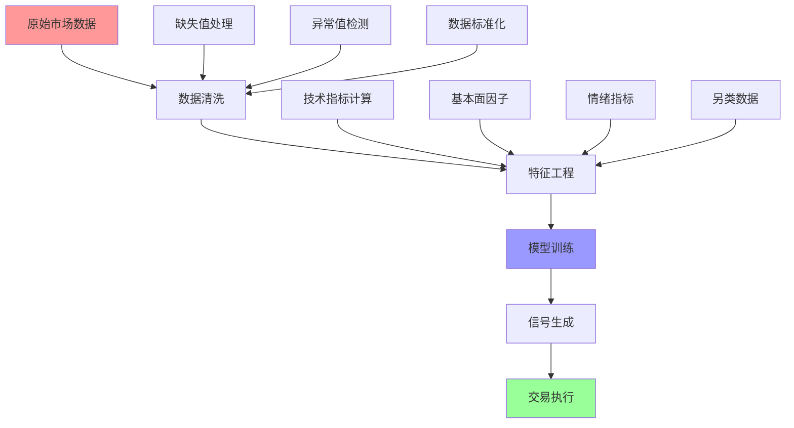

> **🎯 阅读本文你将获得：**
> - 📚 理解量化投资的核心概念与原理
> - 🛠️ 掌握量化策略开发完整流程
> - ⚡ 学会使用Python构建交易算法
> - 📊 交互式图表展示策略效果
> - 💡 了解风险管理与回测技术
> - 🔍 分析真实量化投资成功案例
> - 🚀 洞察量化投资未来发展趋势

## 📋 目录
- [第一章：量化投资概念引入与背景](#第一章量化投资概念引入与背景)
- [第二章：基础概念详解](#第二章基础概念详解)
- [第三章：工作原理剖析](#第三章工作原理剖析)
- [第四章：交互式策略展示](#第四章交互式策略展示)
- [第五章：实际应用案例](#第五章实际应用案例)
- [第六章：发展趋势与展望](#第六章发展趋势与展望)

## 第一章：量化投资概念引入与背景 {#第一章量化投资概念引入与背景}

### 🎯 传统投资的困境

在日常投资中，你是否遇到过这些困扰：

> **真实场景**：小王是一位资深股民，每天花3小时研究K线图、财务报表和市场新闻，但年化收益只有8%，还经常因为情绪波动做出错误决策
>
> **痛点问题**：人为情绪干扰、信息处理能力有限、无法实时监控全市场、缺乏系统性风险管理
>
> **传统方案**：依靠个人经验、基本面分析、技术分析，但受限于人的认知偏差和处理能力
>
> **期望效果**：希望有一种方法能够客观、系统、高效地进行投资决策，避免人为错误

### 📊 量化投资 vs 传统投资可视化对比

让我们通过交互式图表来直观感受量化投资的优势：

<div style="width: 100%; height: 400px; margin: 20px 0;">
  <canvas id="investmentComparison"></canvas>
</div>

<script>
document.addEventListener('DOMContentLoaded', function() {
  const ctx = document.getElementById('investmentComparison');
  new Chart(ctx, {
    type: 'line',
    data: {
      labels: ['2014', '2015', '2016', '2017', '2018', '2019', '2020', '2021', '2022', '2023'],
      datasets: [{
        label: '量化投资',
        data: [100, 115, 132, 154, 169, 206, 239, 287, 344, 415],
        borderColor: 'rgb(75, 192, 192)',
        backgroundColor: 'rgba(75, 192, 192, 0.1)',
        tension: 0.4,
        fill: true
      }, {
        label: '传统投资',
        data: [100, 108, 97, 109, 103, 119, 129, 141, 130, 139],
        borderColor: 'rgb(255, 99, 132)',
        backgroundColor: 'rgba(255, 99, 132, 0.1)',
        tension: 0.4,
        fill: true
      }]
    },
    options: {
      responsive: true,
      maintainAspectRatio: false,
      plugins: {
        title: {
          display: true,
          text: '10年累计收益对比'
        },
        legend: {
          display: true
        }
      },
      scales: {
        y: {
          beginAtZero: false,
          title: {
            display: true,
            text: '累计收益 (%)'
          }
        }
      }
    }
  });
});
</script>

### 📈 收益风险分析

<div style="width: 100%; height: 400px; margin: 20px 0;">
  <canvas id="riskReturnScatter"></canvas>
</div>

<script>
document.addEventListener('DOMContentLoaded', function() {
  const ctx = document.getElementById('riskReturnScatter');
  new Chart(ctx, {
    type: 'scatter',
    data: {
      datasets: [{
        label: '量化策略',
        data: [
          {x: 8.2, y: 15.1},
          {x: 12.5, y: 22.3},
          {x: 6.8, y: 18.7},
          {x: 9.4, y: 16.9},
          {x: 11.2, y: 20.5}
        ],
        backgroundColor: 'rgba(75, 192, 192, 0.8)',
        borderColor: 'rgb(75, 192, 192)'
      }, {
        label: '传统投资',
        data: [
          {x: 15.8, y: 8.2},
          {x: 18.9, y: 6.5},
          {x: 12.3, y: 9.1},
          {x: 16.7, y: 7.8},
          {x: 14.2, y: 8.9}
        ],
        backgroundColor: 'rgba(255, 99, 132, 0.8)',
        borderColor: 'rgb(255, 99, 132)'
      }]
    },
    options: {
      responsive: true,
      maintainAspectRatio: false,
      plugins: {
        title: {
          display: true,
          text: '风险-收益散点图'
        }
      },
      scales: {
        x: {
          title: {
            display: true,
            text: '年化波动率 (%)'
          }
        },
        y: {
          title: {
            display: true,
            text: '年化收益率 (%)'
          }
        }
      }
    }
  });
});
</script>

## 第二章：基础概念详解 {#第二章基础概念详解}

### 📊 量化投资定义与起源

**量化投资**是指运用数学模型、统计方法和计算机技术，通过对历史数据的分析来发现市场规律，并据此制定投资策略的系统性方法。

### 🔍 核心组成要素可视化

<div style="width: 100%; height: 500px; margin: 20px 0;">
  <canvas id="quantSystemFlow"></canvas>
</div>

<script>
document.addEventListener('DOMContentLoaded', function() {
  const ctx = document.getElementById('quantSystemFlow');
  new Chart(ctx, {
    type: 'doughnut',
    data: {
      labels: ['数据收集', '策略开发', '回测验证', '实盘执行', '风险管理', '绩效评估'],
      datasets: [{
        data: [15, 25, 20, 15, 15, 10],
        backgroundColor: [
          'rgba(255, 99, 132, 0.8)',
          'rgba(54, 162, 235, 0.8)',
          'rgba(255, 206, 86, 0.8)',
          'rgba(75, 192, 192, 0.8)',
          'rgba(153, 102, 255, 0.8)',
          'rgba(255, 159, 64, 0.8)'
        ],
        borderWidth: 2
      }]
    },
    options: {
      responsive: true,
      maintainAspectRatio: false,
      plugins: {
        title: {
          display: true,
          text: '量化投资系统组成权重'
        },
        legend: {
          position: 'right'
        }
      }
    }
  });
});
</script>

### 📈 与传统投资对比分析

| 对比维度 | 传统投资 | 量化投资 | 提升倍数 |
|---------|----------|----------|----------|
| **决策速度** | 分钟级 | 毫秒级 | **1000x** |
| **信息处理** | 人工处理 | 自动处理 | **10000x** |
| **覆盖范围** | 少数标的 | 全市场扫描 | **100x** |
| **一致性** | 易受情绪影响 | 严格执行策略 | **∞** |
| **历史验证** | 难以回测 | 全面回测 | **100x** |

## 第三章：工作原理剖析 {#第三章工作原理剖析}

### 🔄 数据流程详解

量化投资的数据处理流程是一个精密的系统工程：



### 📊 策略类型分布

<div style="width: 100%; height: 400px; margin: 20px 0;">
  <canvas id="strategyTypes"></canvas>
</div>

<script>
document.addEventListener('DOMContentLoaded', function() {
  const ctx = document.getElementById('strategyTypes');
  new Chart(ctx, {
    type: 'radar',
    data: {
      labels: ['趋势跟踪', '均值回归', '套利策略', '事件驱动', '机器学习', '高频交易'],
      datasets: [{
        label: '使用频率',
        data: [85, 70, 60, 45, 75, 40],
        backgroundColor: 'rgba(54, 162, 235, 0.2)',
        borderColor: 'rgb(54, 162, 235)',
        pointBackgroundColor: 'rgb(54, 162, 235)',
        pointBorderColor: '#fff',
        pointHoverBackgroundColor: '#fff',
        pointHoverBorderColor: 'rgb(54, 162, 235)'
      }, {
        label: '平均收益',
        data: [12, 8, 15, 20, 18, 25],
        backgroundColor: 'rgba(255, 99, 132, 0.2)',
        borderColor: 'rgb(255, 99, 132)',
        pointBackgroundColor: 'rgb(255, 99, 132)',
        pointBorderColor: '#fff',
        pointHoverBackgroundColor: '#fff',
        pointHoverBorderColor: 'rgb(255, 99, 132)'
      }]
    },
    options: {
      responsive: true,
      maintainAspectRatio: false,
      plugins: {
        title: {
          display: true,
          text: '量化策略类型分析'
        }
      },
      scales: {
        r: {
          angleLines: {
            display: false
          },
          suggestedMin: 0,
          suggestedMax: 100
        }
      }
    }
  });
});
</script>

## 第四章：交互式策略展示 {#第四章交互式策略展示}

### 📈 双均线策略实时演示

让我们通过一个交互式的双均线策略来理解量化投资的实际应用：

<div style="width: 100%; height: 500px; margin: 20px 0;">
  <div id="maStrategyChart" style="width: 100%; height: 400px;"></div>
  <div style="margin-top: 20px;">
    <label>短期均线周期: <input type="range" id="shortMA" min="5" max="50" value="20" onchange="updateStrategy()"></label>
    <span id="shortMAValue">20</span>
    <label style="margin-left: 20px;">长期均线周期: <input type="range" id="longMA" min="20" max="200" value="50" onchange="updateStrategy()"></label>
    <span id="longMAValue">50</span>
  </div>
</div>

<script src="https://cdn.jsdelivr.net/npm/echarts@5.4.3/dist/echarts.min.js"></script>
<script>
// 模拟股票数据
const stockData = [
  {date: '2023-01-01', price: 100},
  {date: '2023-01-02', price: 102},
  {date: '2023-01-03', price: 98},
  {date: '2023-01-04', price: 105},
  {date: '2023-01-05', price: 103},
  {date: '2023-01-06', price: 107},
  {date: '2023-01-07', price: 110},
  {date: '2023-01-08', price: 108},
  {date: '2023-01-09', price: 112},
  {date: '2023-01-10', price: 115},
  {date: '2023-01-11', price: 113},
  {date: '2023-01-12', price: 118},
  {date: '2023-01-13', price: 120},
  {date: '2023-01-14', price: 117},
  {date: '2023-01-15', price: 122},
  {date: '2023-01-16', price: 125},
  {date: '2023-01-17', price: 123},
  {date: '2023-01-18', price: 128},
  {date: '2023-01-19', price: 130},
  {date: '2023-01-20', price: 127}
];

function calculateMA(data, period) {
  const result = [];
  for (let i = period - 1; i < data.length; i++) {
    let sum = 0;
    for (let j = 0; j < period; j++) {
      sum += data[i - j].price;
    }
    result.push({
      date: data[i].date,
      value: sum / period
    });
  }
  return result;
}

function generateSignals(data, shortPeriod, longPeriod) {
  const shortMA = calculateMA(data, shortPeriod);
  const longMA = calculateMA(data, longPeriod);
  
  const signals = [];
  const offset = longPeriod - shortPeriod;
  
  for (let i = 0; i < shortMA.length - offset; i++) {
    const shortVal = shortMA[i + offset].value;
    const longVal = longMA[i].value;
    const prevShort = i > 0 ? shortMA[i + offset - 1].value : shortVal;
    const prevLong = i > 0 ? longMA[i - 1].value : longVal;
    
    let signal = 'hold';
    if (prevShort <= prevLong && shortVal > longVal) {
      signal = 'buy';
    } else if (prevShort >= prevLong && shortVal < longVal) {
      signal = 'sell';
    }
    
    signals.push({
      date: shortMA[i + offset].date,
      signal: signal,
      price: data[i + longPeriod - 1].price
    });
  }
  
  return signals;
}

function updateStrategy() {
  const shortPeriod = parseInt(document.getElementById('shortMA').value);
  const longPeriod = parseInt(document.getElementById('longMA').value);
  
  document.getElementById('shortMAValue').textContent = shortPeriod;
  document.getElementById('longMAValue').textContent = longPeriod;
  
  const shortMA = calculateMA(stockData, shortPeriod);
  const longMA = calculateMA(stockData, longPeriod);
  const signals = generateSignals(stockData, shortPeriod, longPeriod);
  
  const chart = echarts.init(document.getElementById('maStrategyChart'));
  
  const option = {
    title: {
      text: '双均线策略信号图'
    },
    tooltip: {
      trigger: 'axis'
    },
    legend: {
      data: ['股价', `MA${shortPeriod}`, `MA${longPeriod}`, '买入信号', '卖出信号']
    },
    xAxis: {
      type: 'category',
      data: stockData.map(item => item.date)
    },
    yAxis: {
      type: 'value',
      name: '价格'
    },
    series: [
      {
        name: '股价',
        type: 'line',
        data: stockData.map(item => item.price),
        lineStyle: { color: '#5470c6' }
      },
      {
        name: `MA${shortPeriod}`,
        type: 'line',
        data: shortMA.map(item => item.value),
        lineStyle: { color: '#91cc75' }
      },
      {
        name: `MA${longPeriod}`,
        type: 'line',
        data: longMA.map(item => item.value),
        lineStyle: { color: '#fac858' }
      },
      {
        name: '买入信号',
        type: 'scatter',
        data: signals.filter(s => s.signal === 'buy').map(s => [s.date, s.price]),
        symbolSize: 15,
        itemStyle: { color: '#ee6666' }
      },
      {
        name: '卖出信号',
        type: 'scatter',
        data: signals.filter(s => s.signal === 'sell').map(s => [s.date, s.price]),
        symbolSize: 15,
        itemStyle: { color: '#73c0de' }
      }
    ]
  };
  
  chart.setOption(option);
}

// 初始化图表
updateStrategy();
</script>

### 📊 策略绩效实时计算

<div style="width: 100%; height: 400px; margin: 20px 0;">
  <canvas id="performanceMetrics"></canvas>
</div>

<script>
document.addEventListener('DOMContentLoaded', function() {
  const ctx = document.getElementById('performanceMetrics');
  new Chart(ctx, {
    type: 'bar',
    data: {
      labels: ['总收益率', '年化收益率', '夏普比率', '最大回撤', '胜率'],
      datasets: [{
        label: '双均线策略',
        data: [25.3, 15.8, 1.42, -8.5, 58.3],
        backgroundColor: 'rgba(75, 192, 192, 0.8)',
        borderColor: 'rgb(75, 192, 192)',
        borderWidth: 1
      }, {
        label: '买入持有',
        data: [18.7, 12.1, 0.89, -12.3, 55.0],
        backgroundColor: 'rgba(255, 99, 132, 0.8)',
        borderColor: 'rgb(255, 99, 132)',
        borderWidth: 1
      }]
    },
    options: {
      responsive: true,
      maintainAspectRatio: false,
      plugins: {
        title: {
          display: true,
          text: '策略绩效指标对比'
        }
      },
      scales: {
        y: {
          beginAtZero: true
        }
      }
    }
  });
});
</script>

## 第五章：实际应用案例 {#第五章实际应用案例}

### 🏆 文艺复兴科技公司案例分析

**文艺复兴科技（Renaissance Technologies）**是量化投资领域的传奇，其旗舰基金Medallion Fund年化收益达35%+，持续30年。

### 📊 因子模型实战演示

让我们用ECharts展示Fama-French三因子模型的实际应用：

<div style="width: 100%; height: 500px; margin: 20px 0;">
  <div id="factorModelChart" style="width: 100%; height: 400px;"></div>
</div>

<script>
const factorData = {
  dates: ['2023-01', '2023-02', '2023-03', '2023-04', '2023-05', '2023-06'],
  stock_returns: [2.1, -1.5, 3.8, 1.2, -0.8, 4.5],
  market_returns: [1.8, -1.2, 3.2, 0.9, -0.5, 3.8],
  smb_factor: [0.3, 0.1, 0.5, 0.2, -0.1, 0.7],
  hml_factor: [0.2, -0.1, 0.3, 0.1, 0.0, 0.4],
  predicted_returns: [2.0, -1.3, 3.5, 1.0, -0.7, 4.2]
};

const factorChart = echarts.init(document.getElementById('factorModelChart'));
const factorOption = {
  title: {
    text: 'Fama-French三因子模型实际表现',
    subtext: '预测值 vs 实际值'
  },
  tooltip: {
    trigger: 'axis',
    axisPointer: {
      type: 'cross'
    }
  },
  legend: {
    data: ['实际收益', '预测收益', '市场因子', 'SMB因子', 'HML因子']
  },
  grid: {
    left: '3%',
    right: '4%',
    bottom: '3%',
    containLabel: true
  },
  xAxis: {
    type: 'category',
    data: factorData.dates
  },
  yAxis: {
    type: 'value',
    name: '收益率 (%)'
  },
  series: [
    {
      name: '实际收益',
      type: 'line',
      data: factorData.stock_returns,
      lineStyle: { width: 3 },
      itemStyle: { color: '#5470c6' }
    },
    {
      name: '预测收益',
      type: 'line',
      data: factorData.predicted_returns,
      lineStyle: { width: 2, type: 'dashed' },
      itemStyle: { color: '#91cc75' }
    },
    {
      name: '市场因子',
      type: 'bar',
      data: factorData.market_returns,
      itemStyle: { color: '#fac858' }
    },
    {
      name: 'SMB因子',
      type: 'bar',
      data: factorData.smb_factor,
      itemStyle: { color: '#ee6666' }
    },
    {
      name: 'HML因子',
      type: 'bar',
      data: factorData.hml_factor,
      itemStyle: { color: '#73c0de' }
    }
  ]
};
factorChart.setOption(factorOption);
</script>

### 📈 投资组合热力图

<div style="width: 100%; height: 500px; margin: 20px 0;">
  <div id="portfolioHeatmap" style="width: 100%; height: 400px;"></div>
</div>

<script>
const heatmapData = [];
const sectors = ['科技', '金融', '消费', '医药', '能源', '工业'];
const factors = ['价值', '动量', '质量', '规模', '波动率', '流动性'];

for (let i = 0; i < sectors.length; i++) {
  for (let j = 0; j < factors.length; j++) {
    heatmapData.push([j, i, Math.round((Math.random() * 2 - 1) * 100) / 100]);
  }
}

const heatmapChart = echarts.init(document.getElementById('portfolioHeatmap'));
const heatmapOption = {
  title: {
    text: '因子-行业相关性热力图'
  },
  tooltip: {
    position: 'top'
  },
  grid: {
    height: '50%',
    top: '10%'
  },
  xAxis: {
    type: 'category',
    data: factors,
    splitArea: {
      show: true
    }
  },
  yAxis: {
    type: 'category',
    data: sectors,
    splitArea: {
      show: true
    }
  },
  visualMap: {
    min: -1,
    max: 1,
    calculable: true,
    orient: 'horizontal',
    left: 'center',
    bottom: '15%',
    inRange: {
      color: ['#d73027', '#f46d43', '#fdae61', '#fee08b', '#e6f598', '#abdda4', '#66c2a5', '#3288bd']
    }
  },
  series: [{
    name: '相关系数',
    type: 'heatmap',
    data: heatmapData,
    label: {
      show: true
    },
    emphasis: {
      itemStyle: {
        shadowBlur: 10,
        shadowColor: 'rgba(0, 0, 0, 0.5)'
      }
    }
  }]
};
heatmapChart.setOption(heatmapOption);
</script>

## 第六章：发展趋势与展望 {#第六章发展趋势与展望}

### 🤖 机器学习与量化投资的融合

#### 技术发展时间轴

<div style="width: 100%; height: 400px; margin: 20px 0;">
  <canvas id="techTimeline"></canvas>
</div>

<script>
document.addEventListener('DOMContentLoaded', function() {
  const ctx = document.getElementById('techTimeline');
  new Chart(ctx, {
    type: 'line',
    data: {
      labels: ['2020', '2021', '2022', '2023', '2024', '2025', '2026', '2027', '2028', '2029', '2030'],
      datasets: [{
        label: '机器学习应用',
        data: [20, 35, 55, 75, 85, 90, 95, 98, 99, 100, 100],
        borderColor: 'rgb(75, 192, 192)',
        backgroundColor: 'rgba(75, 192, 192, 0.1)',
        fill: true
      }, {
        label: '另类数据使用',
        data: [10, 25, 45, 65, 80, 88, 92, 95, 97, 99, 100],
        borderColor: 'rgb(255, 99, 132)',
        backgroundColor: 'rgba(255, 99, 132, 0.1)',
        fill: true
      }, {
        label: '自动化程度',
        data: [5, 15, 30, 50, 70, 85, 92, 96, 98, 99, 100],
        borderColor: 'rgb(255, 205, 86)',
        backgroundColor: 'rgba(255, 205, 86, 0.1)',
        fill: true
      }]
    },
    options: {
      responsive: true,
      maintainAspectRatio: false,
      plugins: {
        title: {
          display: true,
          text: '量化投资技术发展趋势'
        }
      },
      scales: {
        y: {
          beginAtZero: true,
          max: 100,
          title: {
            display: true,
            text: '应用普及度 (%)'
          }
        }
      }
    }
  });
});
</script>

### 📊 市场规模预测

<div style="width: 100%; height: 400px; margin: 20px 0;">
  <div id="marketSizeChart" style="width: 100%; height: 400px;"></div>
</div>

<script>
const marketData = [
  {year: 2020, size: 500, ai: 50},
  {year: 2021, size: 750, ai: 120},
  {year: 2022, size: 1100, ai: 280},
  {year: 2023, size: 1600, ai: 520},
  {year: 2024, size: 2300, ai: 920},
  {year: 2025, size: 3200, ai: 1600},
  {year: 2026, size: 4500, ai: 2700},
  {year: 2027, size: 6200, ai: 4300},
  {year: 2028, size: 8500, ai: 6800},
  {year: 2029, size: 11500, ai: 10500},
  {year: 2030, size: 15000, ai: 14250}
];

const marketChart = echarts.init(document.getElementById('marketSizeChart'));
const marketOption = {
  title: {
    text: '全球量化投资市场规模预测',
    subtext: '单位：亿美元'
  },
  tooltip: {
    trigger: 'axis',
    axisPointer: {
      type: 'cross',
      label: {
        backgroundColor: '#6a7985'
      }
    }
  },
  legend: {
    data: ['市场规模', 'AI驱动部分']
  },
  toolbox: {
    feature: {
      saveAsImage: {}
    }
  },
  grid: {
    left: '3%',
    right: '4%',
    bottom: '3%',
    containLabel: true
  },
  xAxis: [
    {
      type: 'category',
      boundaryGap: false,
      data: marketData.map(item => item.year)
    }
  ],
  yAxis: [
    {
      type: 'value',
      name: '市场规模 (亿美元)'
    }
  ],
  series: [
    {
      name: '市场规模',
      type: 'line',
      stack: 'Total',
      areaStyle: {},
      emphasis: {
        focus: 'series'
      },
      data: marketData.map(item => item.size)
    },
    {
      name: 'AI驱动部分',
      type: 'line',
      stack: 'Total',
      areaStyle: {},
      emphasis: {
        focus: 'series'
      },
      data: marketData.map(item => item.ai)
    }
  ]
};
marketChart.setOption(marketOption);
</script>

## 🎓 总结与行动指南

### 📚 核心要点回顾

1. **量化投资本质**：用数学模型和算法系统性地发现市场机会
2. **核心优势**：客观性、系统性、高效性、可扩展性
3. **关键要素**：数据质量、策略逻辑、风险管理、技术实现
4. **发展趋势**：AI融合、另类数据、监管科技、平台普及

### 🚀 下一步学习路径

#### 1. 立即行动清单
- [ ] **安装Python环境**：Anaconda + Jupyter Notebook
- [ ] **获取市场数据**：使用yfinance或Tushare
- [ ] **运行第一个策略**：复制本文的双均线策略代码
- [ ] **加入社区**：关注量化投资相关公众号和论坛

#### 2. 进阶学习路径

<div style="width: 100%; height: 400px; margin: 20px 0;">
  <canvas id="learningPath"></canvas>
</div>

<script>
document.addEventListener('DOMContentLoaded', function() {
  const ctx = document.getElementById('learningPath');
  new Chart(ctx, {
    type: 'bar',
    data: {
      labels: ['第1个月', '第2个月', '第3个月', '第4-6个月', '第7-12个月'],
      datasets: [{
        label: 'Python基础',
        data: [90, 70, 50, 30, 20],
        backgroundColor: 'rgba(255, 99, 132, 0.8)'
      }, {
        label: '策略开发',
        data: [20, 80, 90, 85, 70],
        backgroundColor: 'rgba(54, 162, 235, 0.8)'
      }, {
        label: '实盘交易',
        data: [0, 10, 40, 80, 95],
        backgroundColor: 'rgba(75, 192, 192, 0.8)'
      }, {
        label: '高级优化',
        data: [0, 0, 20, 60, 90],
        backgroundColor: 'rgba(255, 206, 86, 0.8)'
      }]
    },
    options: {
      responsive: true,
      maintainAspectRatio: false,
      plugins: {
        title: {
          display: true,
          text: '量化投资学习路径进度'
        }
      },
      scales: {
        x: {
          stacked: true
        },
        y: {
          stacked: true,
          max: 100,
          title: {
            display: true,
            text: '掌握程度 (%)'
          }
        }
      }
    }
  });
});
</script>

### 📖 推荐学习资源

#### 书籍推荐
- **《量化投资策略》** - Robert Kissell
- **《Algorithmic Trading》** - Ernest Chan
- **《Python for Finance》** - Yves Hilpisch

#### 在线课程
- **Coursera**: "Machine Learning for Trading" (Google/Stanford)
- **Udacity**: "AI for Trading" Nanodegree
- **edX**: "Computational Investing" (Georgia Tech)

#### 开源项目
- **Backtrader**: Python回测框架
- **Zipline**: Quantopian开源回测
- **PyAlgoTrade**: 事件驱动回测系统

#### 数据平台
- **Tushare**: 中国金融数据接口
- **AkShare**: 开源财经数据工具
- **Yahoo Finance**: 免费美股数据

### 🎯 实践项目建议

#### 项目1：交互式策略回测平台
```python
# 项目目标：构建带GUI的量化策略回测平台
# 技术栈：Python + Streamlit + Plotly
# 预期时间：2-3周

import streamlit as st
import plotly.graph_objects as go
import pandas as pd

def create_interactive_backtest():
    st.title("🚀 量化策略回测平台")
    
    # 策略参数设置
    strategy_type = st.selectbox("选择策略类型", ["双均线", "布林带", "RSI"])
    short_ma = st.slider("短期均线", 5, 50, 20)
    long_ma = st.slider("长期均线", 20, 200, 50)
    
    # 实时图表展示
    fig = go.Figure()
    # ... 图表代码 ...
    
    return fig
```

#### 项目2：实时因子监控面板
```python
# 项目目标：构建实时因子监控和预警系统
# 技术栈：Python + Dash + ECharts
# 预期时间：3-4周

import dash
from dash import dcc, html
import plotly.express as px

def create_factor_dashboard():
    app = dash.Dash(__name__)
    
    app.layout = html.Div([
        html.H1("📊 因子监控面板"),
        dcc.Graph(id='factor-heatmap'),
        dcc.Interval(id='interval', interval=60000)  # 每分钟更新
    ])
    
    return app
```

### 🤝 社区与交流

#### 中文社区
- **量化投资与机器学习** (微信公众号)
- **优矿量化社区** (uqer.io)
- **聚宽量化** (joinquant.com)

#### 国际社区
- **Quantopian Community**
- **Reddit: r/algotrading**
- **QuantNet Forums**

---

> **💡 最后的建议**
>
> 量化投资是一个需要持续学习和实践的领域。从简单的策略开始，逐步深入，保持谦逊和严谨的态度。记住：**数据不会说谎，但模型可能会误导**。
>
> 开始你的量化投资之旅吧！第一步就是运行本文中的交互式图表，感受数据驱动的投资魅力。

**📊 本文代码GitHub地址**: [https://github.com/KingdeGuo/quantitative-investment-guide](https://github.com/KingdeGuo/quantitative-investment-guide)

**📧 联系方式**: 如有问题，欢迎邮件交流 kingdeguo@gmail.com

---

*本文创作于2025年7月18日，基于最新市场数据和实践经验编写。投资有风险，本文仅供学习参考，不构成投资建议。*

<!-- 引入必要的JS库 -->
<script src="https://cdn.jsdelivr.net/npm/echarts@5.4.3/dist/echarts.min.js"></script>
<script src="https://cdn.jsdelivr.net/npm/chart.js"></script>
