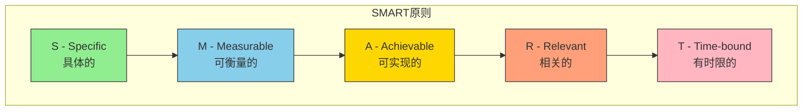
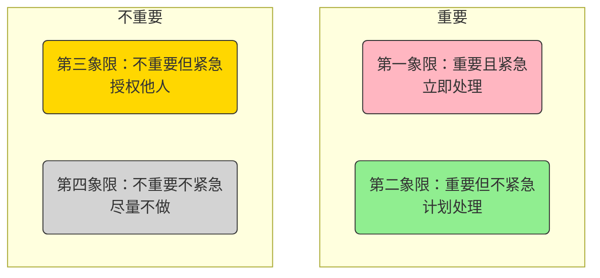
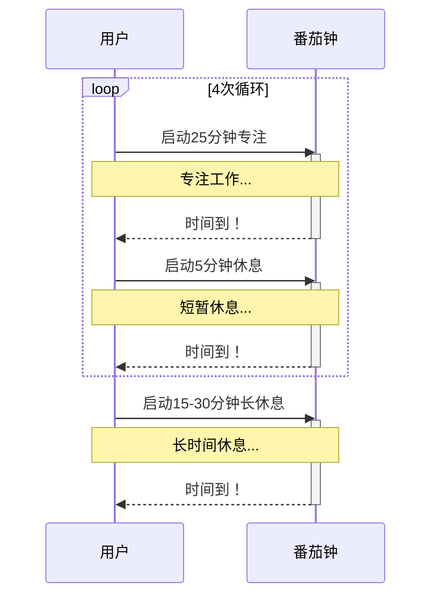

> **🎯 阅读本文你将获得：**
> - 📚 理解时间管理的真正含义
> - 🛠️ 掌握设定清晰目标的方法
> - ⚡ 学会区分任务的优先级
> - 💡 获得多种高效执行策略
> - 🔍 找到适合自己的工具与节奏

## 目录
- [1. 为什么我们总觉得时间不够用？](#1-为什么我们总觉得时间不够用)
- [2. 时间管理的核心：重新定义你的时间观](#2-时间管理的核心重新定义你的时间观)
- [3. 优先级管理：艾森豪威尔矩阵](#3-优先级管理艾森豪威尔矩阵)
- [4. 高效执行：经典时间管理方法](#4-高效执行经典时间管理方法)
- [5. 总结：成为时间的主人](#5-总结成为时间的主人)

## 1. 为什么我们总觉得时间不够用？

在现代社会的快节奏下，“忙”似乎成了每个人的口头禅。我们每天被无数的会议、邮件和信息轰炸，总感觉有做不完的事，时间却像指间沙一样悄然流逝。

> **真实场景**：你是否也曾有过这样的经历？早上信心满满地列下了一长串待办事项，结果一天下来，真正完成的却寥寥无几。紧急任务一个接一个，重要的规划却一拖再拖。
> 
> **痛点问题**：这种状态被称为“穷忙”，即虽然看起来很忙碌，但效率低下，缺乏成就感。其根源在于我们常常被动地应对外部需求，而忽略了主动规划自己的时间。
> 
> **期望效果**：理想的时间管理并非让我们变成永不停歇的机器，而是帮助我们理清思绪，聚焦于真正重要的事情，从而在工作和生活之间找到平衡。

本篇文章将带你系统地学习时间管理的艺术，从核心理念到实用工具，让你彻底告别混乱，重新掌控自己的时间。

## 2. 时间管理的核心：重新定义你的时间观

### 什么是真正的时间管理？

很多人误以为时间管理就是把所有时间都填满，其实恰恰相反。**真正的时间管理，是对自己注意力的管理，是选择做什么、不做什么的艺术。** 它的核心不是“管住时间”，而是“管理自己”。

### 关键原则：要事第一

史蒂芬·柯维在《高效能人士的七个习惯》中提出的“要事第一”原则，是时间管理的基石。这意味着我们应该将大部分精力投入到那些对实现个人和职业目标至关重要的事情上，而不是被紧急但不重要的小事牵着鼻子走。

### 设定SMART目标

没有明确的目标，时间管理就无从谈起。SMART原则为我们提供了一个清晰的目标设定框架：

- **S (Specific)**：目标必须是具体的。例如，“提升英语水平”就不如“在三个月内背完500个雅思核心词汇”具体。
- **M (Measurable)**：目标必须是可衡量的。你需要有明确的指标来判断是否达成了目标。
- **A (Achievable)**：目标必须是可实现的。好高骛远的目标只会打击自信心。
- **R (Relevant)**：目标必须与你的长期规划相关。
- **T (Time-bound)**：目标必须有明确的截止日期。

## 3. 优先级管理：艾森豪威尔矩阵

面对繁杂的任务，如何决定先做什么？美国的艾森豪威尔总统发明了一个简单而强大的工具——**艾森豪威尔矩阵**。它将任务按照“重要”和“紧急”两个维度分为四个象限，帮助我们快速做出决策。

### 四象限法则详解

- **第一象限 (Do)**：重要且紧急。例如，处理突发的客户危机、完成明天到期的重要报告。这是需要立即投入精力去解决的区域。
- **第二象限 (Plan)**：重要但不紧急。例如，学习新技能、制定长期规划、锻炼身体。这是决定我们长期发展的关键区域，最值得我们投入时间。
- **第三象限 (Delegate)**：不重要但紧急。例如，回复一些不重要的邮件、参加不必要的会议。如果可能，应尽量授权给他人处理。
- **第四象限 (Eliminate)**：不重要不紧急。例如，无目的地刷社交媒体、看无关的八卦新闻。这些活动应尽量减少或消除。

高效能人士会把大部分时间投入到第二象限，通过提前规划，防止事情演变成第一象限的危机。

## 4. 高效执行：经典时间管理方法

有了目标和优先级，下一步就是如何高效执行。以下是几种广受欢迎的时间管理方法：

| 方法名称 | 核心思想 | 优点 | 适用场景 |
| :--- | :--- | :--- | :--- |
| **番茄工作法** | 25分钟专注工作 + 5分钟休息 | 保持高度专注，防止疲劳 | 需要长时间专注的任务，如写作、编程 |
| **两分钟规则** | 如果一件事能在两分钟内完成，就立即去做 | 克服拖延，快速清空琐事 | 回复简单邮件、整理桌面等 |
| **批处理** | 将性质类似的任务集中处理 | 减少任务切换的精力损耗 | 集中回复邮件、统一打电话 |

### 番茄工作法 (Pomodoro Technique)
选择一个待完成的任务，将番茄钟设为25分钟，专注工作，中途不允许做任何与该任务无关的事，直到番茄钟响起，然后进行短暂休息。每四个番茄时段可进行一次长休息。

### 两分钟规则
这是《搞定》一书作者戴维·艾伦提出的概念。其核心在于，对于那些能迅速解决的小任务，不要犹豫，立刻动手。这能有效避免小事堆积成山的心理负担。

### 批处理 (Batching)
大脑在不同任务之间切换需要消耗能量。批处理就是将同类型的任务（如回复邮件、打回访电话）放在一个时间段内集中完成，从而提高整体效率。

## 5. 总结：成为时间的主人

时间管理不是一蹴而就的技能，它需要不断地实践和调整。

- **核心要点回顾**：
  - 时间管理是注意力的管理。
  - 用SMART原则设定清晰目标。
  - 用艾森豪威尔矩阵区分优先级。
  - 选择适合自己的方法高效执行。

- **持续改进的建议**：
  - **定期复盘**：每周花15分钟回顾本周的时间使用情况，总结得失。
  - **保持灵活**：计划赶不上变化，学会适应突发状况，及时调整计划。
  - **关注精力**：保证充足的睡眠和锻炼，精力是高效工作的基础。

- **推荐实用工具**：
  - **待办事项**：Microsoft To Do, TickTick
  - **笔记与规划**：Notion, Obsidian
  - **日历**：Google Calendar, Fantastical

希望这篇文章能为你提供一个清晰的行动框架。从今天起，尝试运用其中的一两个方法，相信你会慢慢感受到掌控时间带来的从容与高效。
