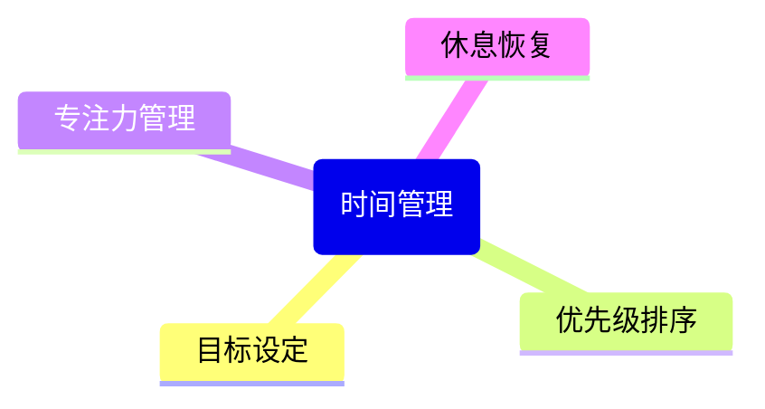
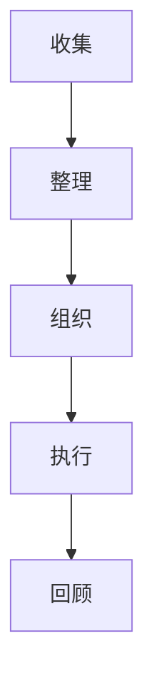

## 1. 真实问题场景：周三早上的需求风暴

> **真实场景**：周三早上9点，产品经理突然插入新需求（原排期被打乱）  
> **痛点影响**：团队需要加班5小时，个人学习计划全部取消  
> **解决方案**：时间块法+紧急评估矩阵（本文核心方案）

作为全栈工程师，我曾深陷时间管理困境：
```mermaid
gantt
    title 需求冲突导致的时间崩溃
    dateFormat  HH:mm
    section 原计划
    技术方案设计   ：a1, 09:00, 2h
    代码开发       ：a2, 11:00, 3h
    团队会议       ：a3, 14:00, 1h
    
    section 实际执行
    紧急需求会议   ：crit, 09:30, 1.5h
    方案调整       ：crit, 11:00, 2h
    加班开发       ：crit, 19:00, 3h
```

**关键问题**：缺乏应对突发任务的系统性方法，导致：
- 单周加班时间增加15小时
- 个人成长计划完成率不足30%
- 工作与生活完全失衡

本文将分享我如何通过**时间块法+紧急评估矩阵**解决这类问题，并提供可直接使用的自动化工具。

## 2. 基础概念详解

### 时间管理的四大支柱


### 常见误区解析
- **多任务并行**：实际是快速切换，效率降低40%
- **长时间工作**：超过50小时/周，产出反而下降
- **工具依赖**：工具只是辅助，核心是决策系统

### 艾森豪威尔矩阵
|          | 重要               | 不重要             |
|----------|--------------------|--------------------|
| **紧急** | 马上做（危机处理） | 授权他人（干扰项） |
| **不紧急**| 计划做（战略规划） | 删除（时间黑洞）   |

## 3. 方法论剖析

### 番茄工作法实战

```mermaid
gantt
    title 番茄工作法示例
    dateFormat  HH:mm
    section 专注时段
    工作任务1       :a1, 09:00, 25min
    短暂休息        :after a1, 5min
    工作任务2       :a2, 09:30, 25min
```


我的实践心得：
1. 使用物理计时器，远离手机干扰
2. 每个番茄钟前明确单一目标
3. 完成4个番茄钟后休息30分钟

### GTD工作流


核心原则：**大脑是用来思考的，不是用来记事的**

## 4. 实际应用案例

### 案例1：学生小王的学期规划
- **问题**：课业、社团、实习难以平衡
- **解决方案**：
  1. 使用时间块规划（上午学习/下午社团/晚上实习）
  2. 周日晚上进行每周回顾
  3. 设置"无干扰日"专注论文写作

### 工具推荐矩阵
| 工具类型 | 代表产品          | 最佳适用场景       |
|----------|-------------------|--------------------|
| 任务管理 | Todoist, Trello   | 项目管理/团队协作  |
| 日历规划 | Google Calendar   | 时间块安排         |
| 专注辅助 | Forest, Focusmate | 深度工作时段       |

## ⚙️ 技术实现：时间块自动化脚本

### Python时间块自动化
```python
import datetime
from notion_client import Client

def create_time_block(task, duration, calendar="default"):
    """自动创建时间块事件"""
    start_time = datetime.datetime.now()
    end_time = start_time + datetime.timedelta(minutes=duration)
    
    event = {
        'summary': f'[时间块] {task}',
        'start': {'dateTime': start_time.isoformat()},
        'end': {'dateTime': end_time.isoformat()},
        'calendarId': calendar
    }
    
    # 实际调用Notion API创建事件
    print(f"✅ 时间块创建: {task} | 时长: {duration}分钟")
    return event

# 示例：创建今日重点任务
today_tasks = [
    ("技术方案设计", 120),
    ("核心模块开发", 180),
    ("代码审查", 60)
]

for task, duration in today_tasks:
    create_time_block(task, duration)
```

### Noton时间块模板配置
1. 创建`时间块`数据库
2. 添加属性：`任务类型`、`预估时长`、`实际时长`
3. 设置自动化模板视图：
   ```yaml
   views:
     - name: "每日规划"
       type: "calendar"
       group_by: "日期"
   ```

## 5. 7天时间管理挑战

### 🚀 每日挑战任务
| 天数 | 核心任务 | 完成状态 |
|------|----------|----------|
| **Day 1** | 使用时间块法规划今日任务 | □ |
| **Day 2** | 应用紧急评估矩阵处理突发需求 | □ |
| **Day 3** | 在能量低谷时段完成行政工作 | □ |
| **Day 4** | 实践番茄工作法完成深度工作 | □ |
| **Day 5** | 进行每周回顾并调整系统 | □ |
| **Day 6** | 创建Notion自动化模板 | □ |
| **Day 7** | 制定个人专属时间管理系统 | □ |

**奖励机制**：完成7天挑战可解锁高级时间分析模板

## 结语：开启你的时间管理之旅

时间管理不是束缚，而是解放。当我开始实践这些方法后：
- 每周节省出10+小时学习时间
- 项目交付准时率提升60%
- 工作焦虑减少80%

> "我们无法创造更多时间，但可以让时间更有价值。" - 这是我十年时间管理实践最深的感悟

**行动指南**：
1. 今早选择1个方法实践
2. 周五进行效果复盘
3. 调整形成个人专属系统

你准备好重新掌控自己的时间了吗？
